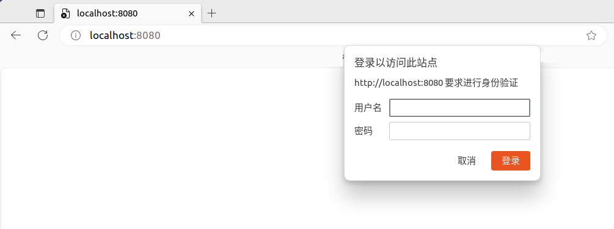

# 有关Go语言的一些简单使用备忘

## 1. 在 Ubuntu 22.04 下安装

#### 1.1 安装
安装命令：
```bash
sudo apt install golang-go
```
安装后，可以用以下命令查看安装的版本：
```bash
go version
```
如果使用 snap 安装的话版本会更新一些。

#### 1.2 GOPROXY访问设置
GOPROXY 是Go语言官方提供的一种通过中间代理商来为用户提供包下载服务的方式，在Go语言编程中会经常使用到。GOPROXY默认指向的是“proxy.golang.org”，在国内一般很难访问，需要我们另外设置。我目前使用的是七牛云提供的“goproxy.cn”，设置命令如下：
```bash
go env -w GOPROXY=https://goproxy.cn
```
这个实际对应的是~/.config/go/env文件。国内还有其他代理服务器地址，大家有兴趣的话可以去试试。

#### 1.3 开发工具
我目前使用的工具是免费开源的 Visual Studio Code。据说JetBrains的GoLand更好用，不过要收费，目前的报价是每个用户第一年2050元人民币。因为我只是个人偶尔用一下Go，所以没有必要购买，对于以Go语言开发为主的朋友可以考虑购买。


## 2. 项目的组织结构

### 2.1 创建最基本内容

#### 2.1.1 创建项目文件夹

示例：
```bash
mkdir basic_web_server
cd basic_web_server
```

#### 2.1.2 初始化模块
```bash
go mod init basic_web_server
```
执行后会产生文件go.mod，此文件用于跟踪代码的依赖关系，该文件只包含模块名称和代码支持的 Go 版本。但当添加依赖项时，go.mod 文件会列出代码所依赖的版本。这样就能保持构建的可重复性，并让你直接控制要使用的模块版本。

#### 2.1.3 创建存放主程序的目录
可以使用下面的目录结构：
```
basic_web_server/
├── cmd
│   └── main
└── go.mod
```
其中的main文件夹用于存放主程序文件。下面是一个简单的示例：
```go
package main

import "fmt"

func main() {
	fmt.Println("Hello, it's me!")
}

```
以上内容存放在文件 main.go 中。

#### 2.1.4 运行
```bash
go run cmd/main/main.go
```

#### 2.1.5 生成可执行文件
一般我会在项目根目录下创建 bin 文件夹用来存放可执行文件，这时项目的文件目录结构如下：
```
basic_web_server/
├── bin
├── cmd
│   └── main
│       └── main.go
└── go.mod

```
使用 go build 命令：
```bash
go build -o bin/basic_web_server cmd/main/main.go
```
运行后就会在 bin 目录下生成可执行文件：basic_web_server。以上命令要注意一点，输出要在源文件前，就是“-o bin/basic_web_server”一定要放在“cmd/main/main.go”之前，反过来放置会提示找不到文件，这里和 gcc、g++ 不一样。
有兴趣的话可以看看生成的可执行文件的大小，即使源代码非常少，生成的basic_web_server文件仍然达到了1.8M，其中一个主要原因是 Go 二进制文件默认是静态链接的。这意味着所有需要的库和依赖关系都被捆绑到一个可执行文件中，从而确保二进制文件是自包含的，可以在没有外部依赖关系的情况下运行。这固然有其优点，但也会导致二进制文件体积增大。另一个重要因素是默认包含的调试信息和符号。这些信息在开发阶段很有帮助，尤其是在调试时，但在生产过程中可能并不一定需要。可以加入一些参数来缩小生成的二进制文件。
```bash
go build -ldflags "-w -s" -o bin/basic_web_server cmd/main/main.go
```
其中参数“-w”标志会省略 DWARF 符号表，从而有效地删除调试信息，“-s”标志会从二进制文件中删除符号表和调试信息。最后生成的文件缩小到1.2M。

安装方面暂时用不到，以后再介绍。

### 2.2 其他目录

#### 2.2.1 pkg目录
用于存放可重复使用的代码。

#### 2.2.2 internal目录
用于存放私有的库代码。

#### 2.2.3 tests目录
用于存放测试代码。

### 2.3 整体结构
```
basic_web_server/
├── bin
│   └── basic_web_server
├── cmd
│   └── main
│       └── main.go
├── go.mod
├── internal
├── pkg
└── tests
```
实际项目中，一般都会在项目根目录下出现文件“go.sum”，该文件列出了版本所需的直接和间接依赖项的校验和。值得一提的是，go.mod文件对于成功的构建来说已经足够了。那为什么还需要go.sum文件？因为go.sum文件中存在的校验和用于验证每个直接依赖项和间接依赖项的校验和，以确认它们都没有被修改。

## 3. 第一个简单的HTTP服务器

### 3.1 完整源代码
把上面的main.go文件内容用以下代码替换：
```go
package main

import (
	"fmt"
	"log"
	"net/http"
)

const (
	CONN_HOST = "localhost"
	CONN_PORT = "8080"
)

func helloWorld(w http.ResponseWriter, r *http.Request) {
	fmt.Fprintf(w, "Hello, World!")
}

func main() {
	http.HandleFunc("/", helloWorld)
	err := http.ListenAndServe(CONN_HOST+":"+CONN_PORT, nil)
	if err != nil {
		log.Fatal("error starting http server: ", err)
		return
	}
}

```

### 3.2 运行效果
用前面介绍的方法直接运行，或者编译后运行生成的可执行文件。打开浏览器地址输入“localhost:8080”或“127.0.0.1:8080”，结果如下：

使用以下命令也可以看到类似效果：
```bash
curl localhost:8080
```
curl可以使用任何支持的协议（HTTP、FTP、IMAP、POP3、SCP、SFTP、SMTP、TFTP、TELNET、LDAP或FILE）向服务器或从服务器传输数据。

## 4. 实施基本身份验证的简单HTTP服务器

### 4.1 源代码
```go
package main

import (
	"crypto/subtle"
	"fmt"
	"log"
	"net/http"
)

const (
	CONN_HOST  = "localhost"
	CONN_PORT  = "8080"
	ADMIN_USER = "admin"
	ADMIN_PASS = "admin"
)

func helloWorld(w http.ResponseWriter, r *http.Request) {
	fmt.Fprintf(w, "Hello, World!\n")
}

func BasicAuth(handler http.HandlerFunc, realm string) http.HandlerFunc {
	return func(w http.ResponseWriter, r *http.Request) {
		user, pass, ok := r.BasicAuth()
		if !ok || subtle.ConstantTimeCompare([]byte(user),
			[]byte(ADMIN_USER)) != 1 || subtle.ConstantTimeCompare([]byte(pass),
			[]byte(ADMIN_PASS)) != 1 {
			w.Header().Set("WWW-Authenticate", `Basic realm="`+realm+`"`)
			w.WriteHeader(401)
			w.Write([]byte("You are Unauthorized to access the application.\n"))
			return
		}
		handler(w, r)
	}
}

func main() {
	http.HandleFunc("/", BasicAuth(helloWorld,
		"Please enter your username and password"))
	err := http.ListenAndServe(CONN_HOST+":"+CONN_PORT, nil)
	if err != nil {
		log.Fatal("error starting http server: ", err)
		return
	}
}

```

### 4.2 运行效果
用前面介绍的方法直接运行，或者编译后运行生成的可执行文件。打开浏览器地址输入“localhost:8080”或“127.0.0.1:8080”，结果如下：

我们看到了弹出的验证窗口。也可以用curl命令来尝试：
```bash
curl --user admin:admin localhost:8080
```

## 5. 一个简单的静态网站服务器

### 5.1 源代码
main.go文件：
```go
package main

import (
	"fmt"
	"log"
	"net/http"
)

func main() {
	http.Handle("/", http.FileServer(http.Dir("./static")))

	http.HandleFunc("/hi", func(w http.ResponseWriter, r *http.Request) {
		fmt.Fprintf(w, "Hi")
	})

	port := ":8080"
	fmt.Printf("Server is running on port" + port)

	log.Fatal(http.ListenAndServe(port, nil))

}

```

index.html文件：
```html
<html>

<head>
  <title>Home</title>
</head>

<body>
  <h2>Home page</h2>
</body>

</html>
```

about.html文件：
```html
<html>

<head>
  <title>About</title>
</head>

<body>
  <h2>about page!</h2>
</body>

</html>
```

目录结构为：
```
.
├── bin
├── cmd
│   └── main
│       └── main.go
├── go.mod
└── static
    ├── about.html
    └── index.html
```

### 5.2 运行效果
用前面介绍的方法直接运行，或者编译后运行生成的可执行文件。打开浏览器地址输入“localhost:8080”或“127.0.0.1:8080”，结果如下：


输入“localhost:8080/about.html”，显示about页：

