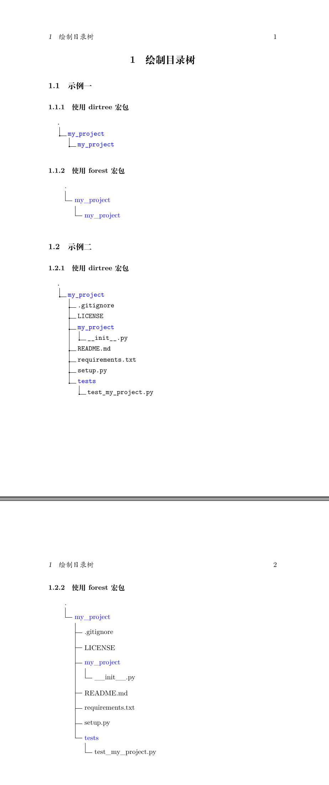

本文介绍在LaTeX中绘制目录树图形的两种方法。

### 一、环境
- Ubuntu 22.04
- XeTeX 3.141592653-2.6-0.999993

### 二、完整示例代码
```latex
% 繁星间漫步，陆巍的博客
\documentclass[UTF8]{ctexart}

\usepackage[dvipsnames, svgnames, x11names]{xcolor}% 颜色支持
\usepackage{dirtree}% 绘制目录树
\usepackage[edges]{forest}% 绘制树状图形

\setlength{\parindent}{2em}% 缩进
\setlength{\parskip}{2ex} % 段间距

\begin{document}


\section{绘制目录树}


\subsection{示例一}


\subsubsection{使用dirtree宏包}
\dirtree{%
  .1 ..
  .2 \textcolor{blue}{my\_project}.
  .3 \textcolor{blue}{my\_project}.
}


\subsubsection{使用forest宏包}
\begin{forest}
  for tree={
    grow'=0,
    folder
  }
    [
      .
      [\textcolor{blue}{my\_project}
        [\textcolor{blue}{my\_project}]
      ]
    ]
\end{forest}


\subsection{示例二}


\subsubsection{使用dirtree宏包}
\dirtree{%
  .1 ..
  .2 \textcolor{blue}{my\_project}.
  .3 .gitignore.
  .3 LICENSE.
  .3 \textcolor{blue}{my\_project}.
  .4 \_\_init\_\_.py.
  .3 README.md.
  .3 requirements.txt.
  .3 setup.py.
  .3 \textcolor{blue}{tests}.
  .4 test\_my\_project.py.
}


\subsubsection{使用forest宏包}
\begin{forest}
  for tree={
    grow'=0,
    folder
  }
    [
      .
      [\textcolor{blue}{my\_project}
        [.gitignore]
        [LICENSE]
        [\textcolor{blue}{my\_project}
          [\_\_init\_\_.py]
        ]
        [README.md]
        [requirements.txt]
        [setup.py]
        [\textcolor{blue}{tests}
          [test\_my\_project.py]
        ]
      ]
    ]
\end{forest}

\end{document}
```

### 三、效果

### 四、说明
- forest宏包实际上使用的是tikz来绘制。另外，forest宏包还可以绘制语法树等图形。
- 注意使用dirtree宏包时，第一行的代码
```latex
 \dirtree{%
 ```
结尾的百分号（%）必须存在，否则编译报错。
- 注意dirtress中，每一项是以小数点作为结束符号。
- 因为forest实际调用的是tikz来绘制图形，所以tikz中的各种参数也可以使用，例如下面的代码：
```latex
  for tree={
    grow'=0,
    folder,
    draw
  }
```
添加draw参数后，目录中的各项就会用方框包裹起来。