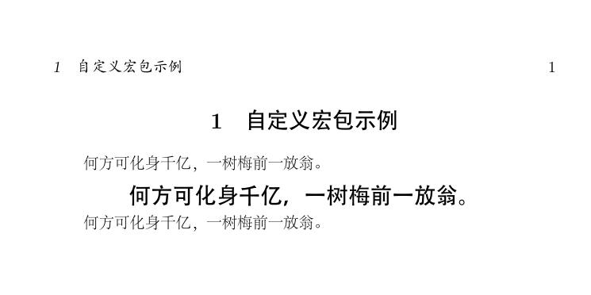

## 一、自定义宏包的方法
在LaTeX中自定义宏包的方法很简单，首先要注意的是宏包文件的扩展名是sty；其次每个宏包文件的开头都有两行固定格式的声明语句：
```latex
\NeedsTeXFormat{LaTeX2e}
\ProvidesPackage{宏包名称}[附带说明]
```

示例：
```latex
\NeedsTeXFormat{LaTeX2e}
\ProvidesPackage{自定义宏包}[2022-08-14 自定义宏包示例]
```

调用自定义宏包的命令同样是\usepackage。

## 二、自定义宏包在Ubuntu操作系统下的存放路径

### 1、与项目文件放在一起

LaTeX在编译时，默认的搜索路径中就包含了项目所在的目录，所以把自定义宏包放在这里可以被编译系统找到。

### 2、使用绝对路径

在实际操作中，把自定义宏包放在项目文件夹内并不方便，不利于宏包的维护与更新，所以我一般都是把自定义宏包放在一个特定的目录内。这种情况下，要让编译系统找到自定义宏包，有几种方法。一种是在项目文件夹内建立指向自定义宏包的软链接；另一种是在tex文档中使用绝对路径来调用自定义宏包，例如：
```tex
\usepackage{/home/youling/tree/temp/自定义宏包}
```

要注意的是，不能使用像“~/tree/temp/自定义宏包”这样的简化写法。

### 3、使用默认的搜索路径

#### 1）找到自己所用系统latex的默认搜索路径
```
kpsewhich -var-value=TEXMFHOME
```
我使用的系统是Ubuntu 20.04，执行此命令后显示的内容是：
```
/home/youling/texmf
```

#### 2）创建默认目录
通常情况下texmf文件夹是不存在的，需要我们自己创建，并且里面还有几层固定的目录，现在用下面的命令创建：
```
mkdir -p ~/texmf/tex/latex/commonstuff
```

### 3）建立指向自定义宏包的链接
接下来把自定义宏包或者相应文件夹放在commonstuff目录内即可。为了更好的灵活性，通常情况下我是建立一个软链接指向存放自定义宏包的目录，例如用以下命令：
```
youling@OP3046:~/texmf/tex/latex/commonstuff$ ln -s ~/tree/temp temp
```
这个命令在commonstuff文件夹内创建一个指向~/tree/temp文件夹的软链接，链接名称也是temp（注意，此示例中，命令是从ln开始的，前面是当前所在目录。）。然后调用自定义宏包的命令写成：
```latex
\usepackage{temp/自定义宏包}
```
这样一来，项目中调用自定义宏包时就不用考虑这些宏包的具体位置，从而提高了灵活性。

## 三、一个完整的简单例子：

### 1、自定义宏包文件：自定义宏包.sty
```latex
% 繁星间漫步，陆巍的博客
\NeedsTeXFormat{LaTeX2e}
\ProvidesPackage{自定义宏包}[2022-07-30 自定义宏包示例]

% 加粗加大居中
\newcommand{\Test}[1]{\Large\centerline{\textbf{#1}}\songti\normalsize}
```
此文件放在~/tree/temp文件夹内。

### 2、调用自定义宏包的示例文件：example1.tex
```latex
% CSDN，繁星间漫步，陆巍的博客
\documentclass[UTF8, fontset=adobe]{ctexart}

\usepackage{temp/自定义宏包}

\begin{document}
\section{自定义宏包示例}
何方可化身千亿，一树梅前一放翁。

\Test{何方可化身千亿，一树梅前一放翁。}

何方可化身千亿，一树梅前一放翁。

\end{document} 
```

### 3、环境
- 操作系统：Ubuntu 20.04
- 引擎：XeTeX 3.14159265-2.6-0.999991

### 4、编译后生成的pdf文件


### 5、注意事项
- 代码中的\documentclass命令，我把字符设为adobe，这个字符不是系统默认安装的，需要自己去下载安装。当然，也可以把fontset=adobe去掉，使用系统默认的字符，只是编译后会有警告信息，但能通过编译。
- texmf目录仅对LaTeX宏包有效，如果latex代码中调用了lua、python代码，texmf目录无效。