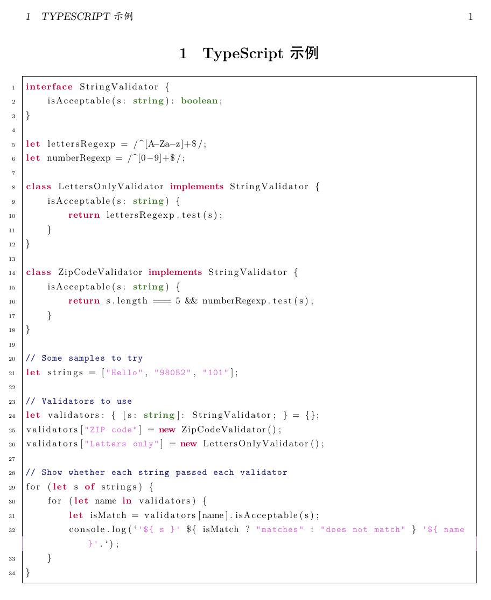

## LaTeX之listings宏包自定义代码样式示例

---

listings宏包已经提供了不少代码显示样式，但还是有些代码并未收录，这个时候候我们就希望能够自己定义添加。为此，本文特举例介绍相关方法。

### 一、环境
- Ubuntu 20.04
- XeTeX 3.14159265-2.6-0.999991
- listings 1.80c（2019/09/10）

### 二、示例
```latex
% 繁星间漫步，陆巍的博客
\documentclass[oneside, UTF8, fontset=adobe]{ctexart}% 中文板式：ctexart，英文版式：article

\usepackage{geometry}% 用于页面设置
\usepackage[dvipsnames, svgnames, x11names]{xcolor}% 颜色支持
\usepackage{listings}% 代码显示支持

\geometry{
  a4paper,
  left = 1in,
  right = 1in,
  top = 1in,
  bottom = 1in
}

% 代码显示样式设置
\lstset{
  breaklines,% 自动换行
  basicstyle=\small,% 设置字体大小
  frame=single,% 单线框
  numbers=left,% 行号在左边
  numberstyle=\tiny,% 行号字体大小
  keywordstyle = \color[RGB]{0, 0, 160},% 关键字颜色
  commentstyle = \color[RGB]{160, 160, 160},% 注释颜色
  stringstyle  = \color[RGB]{0, 0, 255},% 字符串颜色
}

% 定义TypeScript脚本语言显示样式
\lstdefinelanguage{TypeScript}{
  morekeywords={typeof, new, true, false, catch, function, return, null, catch, switch, var, if, in, while, do, else, case, break, public, let, class, export, throw, implements, import, this, interface, of},% 定义2类关键字
  keywordstyle=\color{purple}\bfseries,% 2类关键字风格
  classoffset=2,% 关键字类别2
  morekeywords={string, boolean, },% 定义1类关键字
  keywordstyle=\color{OliveGreen}\bfseries,% 1类关键字风格
  classoffset=1,% 关键字类别1
  morekeywords={constructor,},% 定义1类关键字
  keywordstyle=\color{Cerulean}\bfseries,% 1类关键字风格
  classoffset=0,% 关键字类别0
  identifierstyle=\color{black},% 标识符风格
  sensitive=true,% 大小写敏感。
  comment=[l]{//},% 定义单行注释
  morecomment=[s]{/*}{*/},% 定义多行注释
  commentstyle=\color{MidnightBlue}\ttfamily,% 注释风格
  stringstyle=\color{Orchid}\ttfamily,% 字符串风格
  morestring=[b]',% 定义字符串
  morestring=[b]"% 定义字符串
}

\begin{document}

\section{TypeScript示例}
\begin{lstlisting}[language=TypeScript]
interface StringValidator {
    isAcceptable(s: string): boolean;
}

let lettersRegexp = /^[A-Za-z]+$/;
let numberRegexp = /^[0-9]+$/;

class LettersOnlyValidator implements StringValidator {
    isAcceptable(s: string) {
        return lettersRegexp.test(s);
    }
}

class ZipCodeValidator implements StringValidator {
    isAcceptable(s: string) {
        return s.length === 5 && numberRegexp.test(s);
    }
}

// Some samples to try
let strings = ["Hello", "98052", "101"];

// Validators to use
let validators: { [s: string]: StringValidator; } = {};
validators["ZIP code"] = new ZipCodeValidator();
validators["Letters only"] = new LettersOnlyValidator();

// Show whether each string passed each validator
for (let s of strings) {
    for (let name in validators) {
        let isMatch = validators[name].isAcceptable(s);
        console.log(`'${ s }' ${ isMatch ? "matches" : "does not match" } '${ name }'.`);
    }
}
\end{lstlisting}

\end{document}
```

编译后生成的pdf文件内容如下：


### 三、说明
以上代码中的注释已经比较清楚，就不多作解释，只是要注意：当我们把关键字分为几类时，在定义中的“classoffset”设置，需要倒着来，如上面的2、1、0。