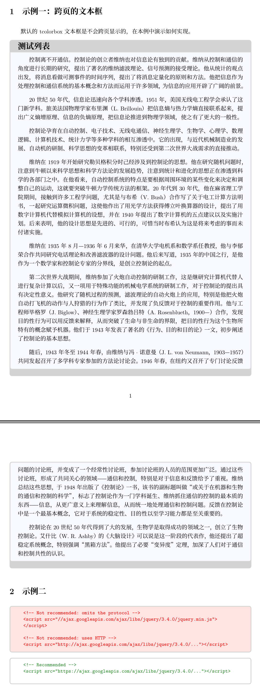

tcolorbox宏包可以为我们提供更好看的文本框，这里列出一些应用例子方便以后查询使用。

### 一、环境
- 操作系统：Ubuntu 20.04
- 引擎：XeTeX 3.14159265-2.6-0.999991

### 二、完整示例代码
```latex
% 繁星间漫步，陆巍的博客
\documentclass[oneside, UTF8, fontset = adobe]{ctexart}

% 注意宏包顺序，有可能会报错
\usepackage{geometry}% 用于页面设置
\usepackage[dvipsnames, svgnames, x11names]{xcolor} % 颜色支持
\usepackage[
  colorlinks=true,
  linkcolor=Navy,
  urlcolor=Navy,
  citecolor=Navy,
  anchorcolor=Navy
]{hyperref}
\usepackage{tcolorbox}% 支持更好的文本框
\tcbuselibrary{skins, breakable}% 支持文本框跨页

% 设置为A4纸
\geometry{%
  a4paper,
  left = 19.1mm,
  right = 19.1mm,
  top = 25.4mm,
  bottom = 25.4mm
}

\setlength{\parindent}{2em}% 缩进
\setlength{\parskip}{2ex} % 段间距


\begin{document}

\section{示例一：跨页的文本框}
默认的tcolorbox文本框是不会跨页显示的，在本例中演示如何实现。

\begin{tcolorbox}[enhanced, colback=GhostWhite, colframe=LightGray, coltitle=black, title=测试列表, fonttitle=\bfseries\Large, bottomrule=3ex, breakable=true]
  \setlength{\parindent}{2em}% 缩进
  \setlength{\parskip}{2ex} % 段间距
  
  控制离不开通信。控制论的创立者维纳也对信息论有独到的贡献。维纳从控制和通信的角度进行长期的研究，提出了著名的维纳滤波理论、信号预测的接受理论。他从统计的观点出发，将消息看做可测事件的时间序列，提出了将消息定量化的原则和方法。他把信息作为处理控制和通信系统的基本概念和方法而运用于许多领域，为信息的应用开辟了广阔的前景。
  
\end{tcolorbox}


\section{示例二}
\begin{tcolorbox}[
  colback=MistyRose,
  coltext=red,
  colframe=LightGray,
  boxrule=0.5mm
  ]
  \begin{verbatim}
  <!-- Not recommended: omits the protocol -->
  <script src="//ajax.googleapis.com/ajax/libs/jquery/3.4.0/jquery.min.js">
  </script>

  <!-- Not recommended: uses HTTP -->
  <script src="http://ajax.googleapis.com/ajax/libs/jquery/3.4.0/..."></script>\end{verbatim}
\end{tcolorbox}

\begin{tcolorbox}[
  colback=white,
  coltext=ForestGreen,
  colframe=LightGray,
  boxrule=0.5mm
  ]
  \begin{verbatim}
  <!-- Recommended -->
  <script src="https://ajax.googleapis.com/ajax/libs/jquery/3.4.0/..."></script>\end{verbatim}
\end{tcolorbox}

\begin{tcolorbox}[
  colback=MistyRose,
  coltext=red,
  colframe=LightGray,
  boxrule=0.5mm
  ]
  \begin{verbatim}
  /* Not recommended: omits the protocol */
  @import '//fonts.googleapis.com/css?family=Open+Sans';

  /* Not recommended: uses HTTP */
  @import 'http://fonts.googleapis.com/css?family=Open+Sans';\end{verbatim}
\end{tcolorbox}

\begin{tcolorbox}[
  colback=white,
  coltext=ForestGreen,
  colframe=LightGray,
  boxrule=0.5mm
  ]
  \begin{verbatim}
  /* Recommended */
  @import 'https://fonts.googleapis.com/css?family=Open+Sans';\end{verbatim}
\end{tcolorbox}

\end{document}
```

### 三、pdf内容


### 四、说明
- 跨页的参数设置是“breakable=true”。
- 本例中把字库设置为adobe字库，这个字库操作系统默认情况下是不带的，需要自己去下载安装。当然，也可以把fontset=adobe设置去掉，以使用系统默认字库，虽然编译能通过，但会有警告提示。
