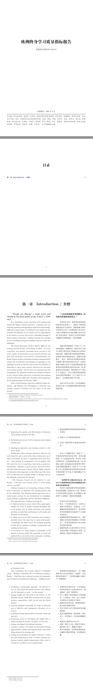

## LaTeX之使用parcolumns宏包实现双栏排版示例

---

在LaTeX中实现双栏或多栏排版的方式有好几种，本文只介绍使用parcolumns宏包来实现。

### 一、环境
- Ubuntu 22.04
- XeTeX 3.141592653-2.6-0.999993

### 二、示例代码
```latex
% 繁星间漫步，陆巍的博客
\documentclass[oneside, UTF8]{ctexbook}

% 注意宏包顺序，有可能会报错
\usepackage{geometry}% 用于页面设置
\usepackage[dvipsnames, svgnames, x11names]{xcolor}% 颜色支持
\usepackage{graphicx}% 图形支持
\usepackage[
  colorlinks=true,
  linkcolor=Navy,
  urlcolor=Navy,
  citecolor=Navy,
  anchorcolor=Navy
]{hyperref}% 设置超链接颜色
\usepackage{enumerate}% 枚举支持
\usepackage{dingbat}% 特殊符号支持，此宏包必须在amssymb宏包前调用，否则报错
\usepackage{enumitem}% 支持调整有序与无序列表中的间距
\usepackage{pifont}%这里用于让注脚符号变成带圆圈的数字
\usepackage{booktabs}% 增强表格功能
\usepackage{colortbl}% 表格颜色
\usepackage{multirow}% 支持表格的多行合并
\usepackage{longtable}% 支持长表格跨页
\usepackage{microtype}% 使文本两端对齐效果更好
\usepackage{parcolumns}% 支持多栏排版

% 设置为A4纸，边距适中模式（参考永中office）
\geometry{
  a4paper,
  left = 19.1mm,
  right = 19.1mm,
  top = 25.4mm,
  bottom = 25.4mm
}

\setlength{\parindent}{2em}% 缩进
\setlength{\parskip}{1ex} % 段间距

% ------------------ 开始 -------------------


\begin{document}


% ------------------ 封面 -------------------
\begin{titlepage}
  \begin{center}
    \quad

    \vspace{.2\textheight}
    \Huge\textbf{欧洲终身学习质量指标报告}

    \vspace{2ex}
    \normalsize 欧盟委员会教育和文化总司

    \vfill
    布鲁塞尔，2002年6月
  \end{center}

  \hrule
  \vspace{1ex}
  \noindent\itshape 参与国：阿尔巴尼亚、奥地利、比利时、波斯尼亚和黑塞哥维那、保加利亚、塞浦路斯、捷克共和国、丹麦、爱沙尼亚、芬兰、前南斯拉夫的马其顿共和国、法国、德国、希腊、匈牙利、冰岛、爱尔兰、意大利、拉脱维亚、列支敦士登、立陶宛、卢森堡、马耳他、荷兰、挪威、波兰、葡萄牙、斯洛伐克共和国、斯洛文尼亚共和国、罗马尼亚、西班牙、瑞典、土耳其、，大不列颠联合王国。
  
\end{titlepage}


% ------------------ 目录 -------------------
\tableofcontents% 生成目录


% ------------------ 正文 -------------------
\mainmatter

\chapter{Introduction / 介绍}
\begin{parcolumns}[colwidths={1=95mm,2=65mm}, sloppy]{2}
  \colchunk{
    \large\textbf{\textit{“People are Europe’s main asset and should be the focal point of the Union’s Policies”}}\footnotemark
  }\footnotetext{Lisbon European Council: Presidency Conclusions, point 24}
  \colchunk{
    \large\textbf{“人民是欧洲最重要的财富，应该成为欧盟政策的焦点。”}\footnotemark[1]
  }\footnotetext[1]{里斯本欧洲理事会：主席结论，第24点}
  \colplacechunks

  \colchunk{
    \normalsize In a knowledge society education and training rank among the highest political priorities. Acquiring and continuously updating and upgrading a high level of knowledge, skills and competencies is considered a prerequisite for the personal development of all citizens and for participation in all aspects of society from active citizenship through to labour market integration. Lifelong learning has emerged as an overarching strategy for enabling citizens to meet new challenges.
  }
  \colchunk{
    在知识社会中，教育和培训是最高的政治优先事项之一。获取并不断更新和提高高水平的知识、技能和能力被认为是所有公民个人发展和参与社会各个方面（从积极的公民身份到融入劳动力市场）的先决条件。终身学习已经成为使公民能够应对新挑战的一项总体战略。
  }
  \colplacechunks

  \colchunk{
    The Lisbon European Council (March, 2000) set the strategic goal for Europe, of becoming, by 2010: \textit{‘the most competitive and dynamic knowledge-based economy in the world, capable of sustainable economic growth with more and better jobs and greater social cohesion’} and furthermore, the Heads of State in their conclusions in Lisbon emphasised the central role of education and training in responding to the challenges of such an objective and invited the Ministers of Education to agree upon concrete objectives for education and training systems. On the basis of a proposal from the Commission, the Ministers of Education adopted a Report on the concrete future objectives of education and training systems in February 2001 and a Detailed work programme for its implementation in February 2002.\footnotemark
  }\footnotetext{Detailed work programme on the follow-up of the objective of education and training systems in Europe}
  \colchunk{
    里斯本欧洲理事会（2000年3月）为欧洲制定了战略目标，即到2010年成为“世界上最具竞争力和最有活力的知识型经济体，能够实现可持续的经济增长，创造更多更好的就业机会，增强社会凝聚力”，此外，各国元首在里斯本的结论中强调了教育和培训在应对这一目标的挑战中的核心作用，并请各国教育部长就教育和培训系统的具体目标达成一致。根据该委员会的建议，教育部长们于2001年2月通过了一份关于教育和培训系统未来具体目标的报告，并于2002年2月通过了一份详细的实施工作方案。\footnotemark[2]
  }\footnotetext[2]{关于欧洲教育和培训系统目标后续行动的详细工作方案}
  \colplacechunks

  \colchunk{
    Three overall strategic objectives, defined in these documents, will influence the development of education and training systems in Europe over the course of the next decade:
    \begin{enumerate}
      \item Improving the quality and effectiveness of education and training systems in the EU;
      \item Facilitating the access of all to education and training systems and;
      \item Opening-up education and training systems to the wider world.
    \end{enumerate}
  }
  \colchunk{
    这些文件中定义的三个总体战略目标将在未来十年影响欧洲教育和培训系统的发展:
    \begin{enumerate}
      \item 提高欧盟教育和培训系统的质量和有效性；
      \item 促进人人享有教育培训体系；
      \item 向更广阔的世界开放教育培训体系。
    \end{enumerate}
  }
  \colplacechunks

  \colchunk{
    Within these three strategic objectives, thirteen concrete objectives and a series of key issues within each one of them was defined. In order to implement these objectives, the “open method of coordination” is to be applied. This will entail the use of cooperation tools such as indicators, benchmarks, exchange of good practice and peer-review. The Barcelona European Council (March, 2002) endorsed the Detailed work programme on the follow-up of the objectives of education and training systems in Europe and set the following overall goal for Europe\footnotemark:
  }\footnotetext{http://europa.eu.int/council/off/conclu/index.htm}
  \colchunk{
    在这三个战略目标中，确定了十三项具体目标和每项目标中的一系列关键问题。为了实施这些目标，将采用 "开放式协调方法"。这将需要使用合作工具，如指标、基准、良好做法的交流和同行评审。巴塞罗那欧洲理事会（2002年3月）批准了关于欧洲教育和培训系统目标后续行动的详细工作方案，并为欧洲确定了以下总体目标\footnotemark[3]：
  }\footnotetext[3]{http://europa.eu.int/council/off/conclu/index.htm}
  \colplacechunks

  \colchunk{
    \textit{“The European Council sets the objective to make Europe’s education and training systems a world quality reference by 2010”}
  }
  \colchunk{
    \textbf{“欧洲理事会制定的目标是，到2010年使欧洲的教育和培训系统成为世界质量的参照标准。”}
  }
  \colplacechunks

  \colchunk{
    Lifelong learning is an overarching strategy of European co-operation in education and training policies and for the individual. The lifelong learning approach is an essential policy strategy for the development of citizenship, social cohesion, employment and for individual fulfilment.
  }
  \colchunk{
    终身学习是欧洲教育和培训政策合作的总体战略，也是针对个人的。终身学习方法是发展公民意识、社会凝聚力、就业和个人发展的一项基本政策战略。
  }
  \colplacechunks

  \colchunk{
    The principal aims of lifelong learning are:
    \begin{itemize}
      \item to build an inclusive society which offers equal opportunities for access to quality learning throughout life to all people, and in which education and training provision is based first and foremost on the needs and demands of individuals,
      \item to adjust the ways in which education and training is provided and at the same time to ensure that people’s knowledge and skills match the changing demands of jobs and occupations, workplace organisation and working methods and,
      \item to encourage and equip people to participate in all spheres of modern public life, especially in social and political life at all levels of the community, including at European level.
    \end{itemize}
  }
  \colchunk{
    终身学习的主要目标是：
    \begin{itemize}
      \item 建立一个包容性的社会，为所有人提供平等的机会，让他们在一生中都能获得高质量的学习，而且教育和培训的提供首先是基于个人的需求和要求，
      \item 调整提供教育和培训的方式，同时确保人们的知识和技能与工作和职业、工作场所的组织和工作方法的变化需求相匹配，
      \item 鼓励和培养人们参与现代公共生活的所有领域，特别是社区各级，包括欧洲一级的社会和政治生活。
    \end{itemize}
  }
  \colplacechunks

  \colchunk{
    The Commission has recently adopted a Communication ‘Making a European Area of Lifelong Learning a Reality’\footnotemark which lays out a coherent strategy for  implementing its objectives including the following ‘building blocks’:
  }\footnotetext{(COM (2001) 678 final)}
  \colchunk{
    欧盟委员会最近通过了一份 "使欧洲终身学习区成为现实 "\footnotemark[4] 的通讯，为实现其目标制定了一个连贯的战略，包括以下 "构建模块"：
  }\footnotetext[4]{(COM (2001) 678 final)}
  \colplacechunks

  \colchunk{
    \begin{itemize}
      \item developing a partnership approach: all relevant actors, in and outside the formal systems, must collaborate for strategies to work ‘on the ground’,
      \item gaining insight into the needs of the learner, or the potential learner, along with learning needs of organisations, communities, wider society and the labour market,
      \item ensuring adequate resourcing, in terms of financing and of effective and transparent allocation of resources,
      \item matching learning opportunities to learners’ needs and interests,
      \item facilitating access by developing the supply side to enable learning by anyone, anywhere, at any time,
      \item valuing non-formal and informal learning,
      \item creating a culture of learning by increasing learning opportunities, raising participation levels and stimulating demand for learning and,
      \item setting up mechanisms for quality assurance, evaluation and monitoring in order to ensure constant progression towards quality improvement with a view to striving for excellence on an ongoing basis.
    \end{itemize}
  }
  \colchunk{
    \begin{itemize}
      \item 发展伙伴关系的方法：正式系统内外的所有相关行为者必须合作，使战略在 "实地 "发挥作用。
      \item 深入了解学习者或潜在学习者的需求，以及组织、社区、更广泛的社会和劳动力市场的学习需求。
      \item 确保在资金和有效、透明的资源分配方面有足够的资源。
      \item 将学习机会与学习者的需求和兴趣相匹配。
      \item 通过发展供给端，促进获取，使任何人、任何地点、任何时间都能学习，
      \item 重视非正规和非正式学习。
      \item 创造一种学习文化，增加学习机会，提高参与水平，刺激学习需求，
      \item 建立质素保证、评估和监察的机制，以确保不断改善质素，务求精益求精。
    \end{itemize}
  }
\end{parcolumns}
\end{document}
```

### 三、编译后pdf显示内容



### 四、说明
- 注意代码“\begin{parcolumns}[colwidths={1=95mm,2=65mm}, sloppy]{2}”中的参数sloppy，它可以自动调节尺寸，从而让分栏中的尺寸警告信息消失。
- \colplacechunks命令在这里表示一组分栏的分界，本例中是两栏，所以每两栏后使用一次这个命令。如果是三栏，那就是每三栏使用一次。
- 注意在文中使用注脚命令时，不能直接使用\footnote{}命令，那样会无法显示注脚内容。请按示例中的方式编写注脚，即把注脚分成两部分来实现。