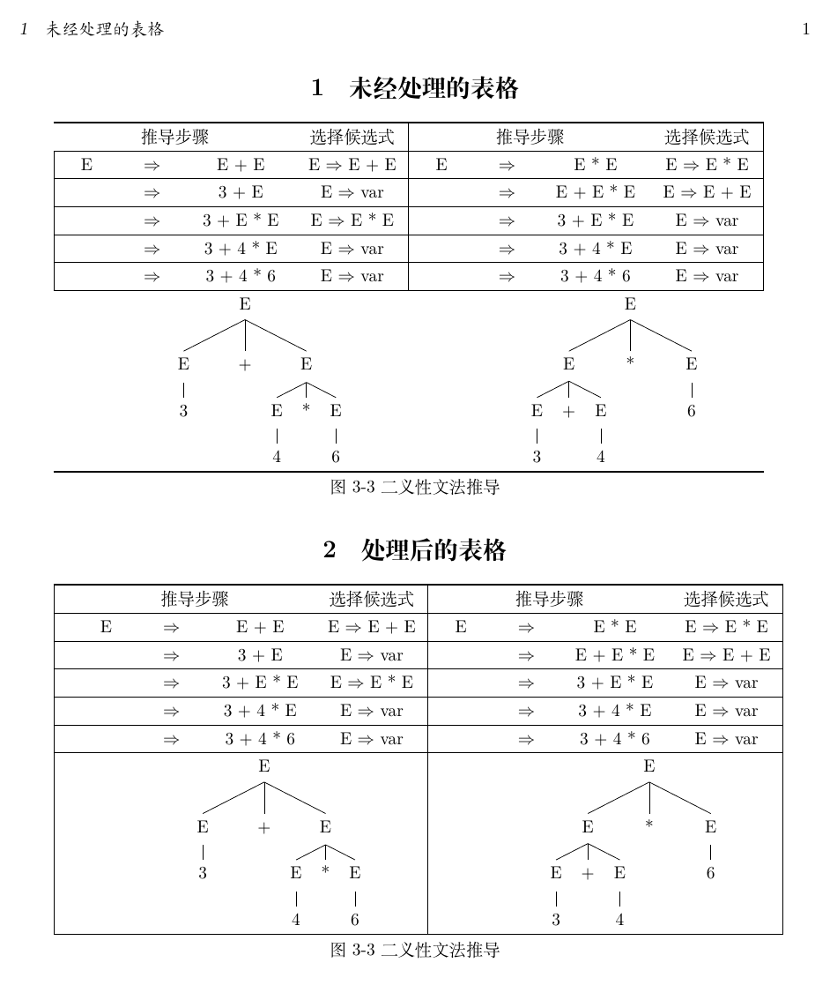

在LaTeX表格绘制中，多列合并通常会使用\multicolumn命令来实现。这个命令会造成所在单元格中的左右竖线不显示，本文介绍解决这个问题的方法。下面的示例代码中列出了处理前与处理后的代码。

---
### 一、环境
- 操作系统：Ubuntu 20.04
- 引擎：XeTeX 3.14159265-2.6-0.999991


#### 二、完整示例代码
```latex
% 繁星间漫步，陆巍的博客
\documentclass[UTF8]{ctexart}

% 注意宏包顺序，有可能会报错
\usepackage{geometry}% 用于页面设置
\usepackage{booktabs}% 增强表格功能
\usepackage{tabularx}% 更多表格功能
\usepackage{multirow}% 支持表格的多行合并
\usepackage{qtree}% 绘制树形图

% 设置为A4纸
\geometry{
  a4paper,
  left = 19.1mm,
  right = 19.1mm,
  top = 25.4mm,
  bottom = 25.4mm
}


% 定义表格对齐方式
\newcolumntype{L}[1]{>{\raggedright\arraybackslash}p{#1}}
\newcolumntype{C}[1]{>{\centering\arraybackslash}p{#1}}
\newcolumntype{R}[1]{>{\raggedleft\arraybackslash}p{#1}}

\begin{document}

\section{未经处理的表格}
\begin{tabular}{|C{10mm}C{10mm}C{20mm}C{20mm}|C{10mm}C{10mm}C{20mm}C{20mm}|}
  \bottomrule
  \multicolumn{3}{c}{推导步骤} & 选择候选式 & \multicolumn{3}{c}{推导步骤} & 选择候选式\\
  \hline
  E & $\Rightarrow$ & E + E & E $\Rightarrow$ E + E & E & $\Rightarrow$ & E * E & E $\Rightarrow$ E * E\\
  \hline
  & $\Rightarrow$ & 3 + E & E $\Rightarrow$ var & & $\Rightarrow$ & E + E * E & E $\Rightarrow$ E + E\\
  \hline
  & $\Rightarrow$ & 3 + E * E & E $\Rightarrow$ E * E & & $\Rightarrow$ & 3 + E * E & E $\Rightarrow$ var\\
  \hline
  & $\Rightarrow$ & 3 + 4 * E & E $\Rightarrow$ var & & $\Rightarrow$ & 3 + 4 * E & E $\Rightarrow$ var\\
  \hline
  & $\Rightarrow$ & 3 + 4 * 6 & E $\Rightarrow$ var & & $\Rightarrow$ & 3 + 4 * 6 & E $\Rightarrow$ var\\
  \hline
  \multicolumn{4}{c}{\Tree [.E [.E 3 ] + [.E [.E 4 ] * [.E 6 ]]]} & \multicolumn{4}{c}{\Tree [.E [.E [.E 3 ] + [.E 4 ]] * [.E 6 ]]}\\
  \toprule
\end{tabular}

\centerline{图3-3 二义性文法推导}


\section{处理后的表格}
% \multicolumn语句会造成表格中的竖线不显示，左边第1根竖线只能用增加一个空列来显示；
% 后面的竖线可以手工用\vline添加竖线。
\begin{tabular}{|p{0mm}C{10mm}C{10mm}C{20mm}C{20mm}|C{10mm}C{10mm}C{20mm}C{20mm}|}
  \bottomrule
  & \multicolumn{3}{c}{推导步骤} & 选择候选式 & \multicolumn{3}{c}{推导步骤} & 选择候选式\\
  \hline
  & E & $\Rightarrow$ & E + E & E $\Rightarrow$ E + E & E & $\Rightarrow$ & E * E & E $\Rightarrow$ E * E\\
  \hline
  & & $\Rightarrow$ & 3 + E & E $\Rightarrow$ var & & $\Rightarrow$ & E + E * E & E $\Rightarrow$ E + E\\
  \hline
  & & $\Rightarrow$ & 3 + E * E & E $\Rightarrow$ E * E & & $\Rightarrow$ & 3 + E * E & E $\Rightarrow$ var\\
  \hline
  & & $\Rightarrow$ & 3 + 4 * E & E $\Rightarrow$ var & & $\Rightarrow$ & 3 + 4 * E & E $\Rightarrow$ var\\
  \hline
  & & $\Rightarrow$ & 3 + 4 * 6 & E $\Rightarrow$ var & & $\Rightarrow$ & 3 + 4 * 6 & E $\Rightarrow$ var\\
  \hline
  & \multicolumn{4}{c}{\Tree [.E [.E 3 ] + [.E [.E 4 ] * [.E 6 ]]]}\vline & \multicolumn{4}{c}{\Tree [.E [.E [.E 3 ] + [.E 4 ]] * [.E 6 ]]}\vline\\
  \toprule
\end{tabular}

\centerline{图3-3 二义性文法推导}

\end{document}
```

### 三、pdf内容


### 四、说明
- 对于表格左边第一根竖线缺失的情况，处理稍微麻烦一些，需要通过增加一个宽度为0的列来解决，使用\vline等方法都会报错。
- 第一根竖线后的竖立都可以通过\vline命令来补上缺失的竖线。
- 本例中使用的是XeTeX引擎，\Rightarrow这样的符号必须放在数学环境下才能通过编译，在LuaTeX引擎下不需要放在数学环境内。