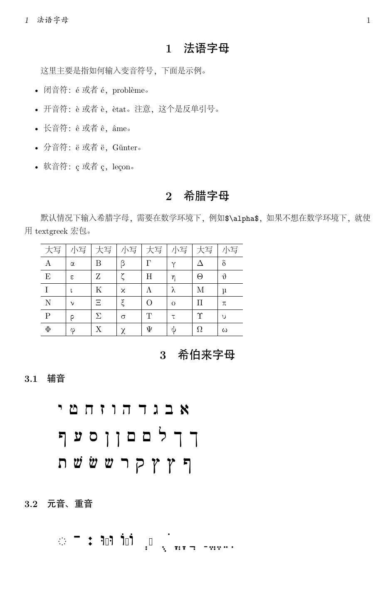
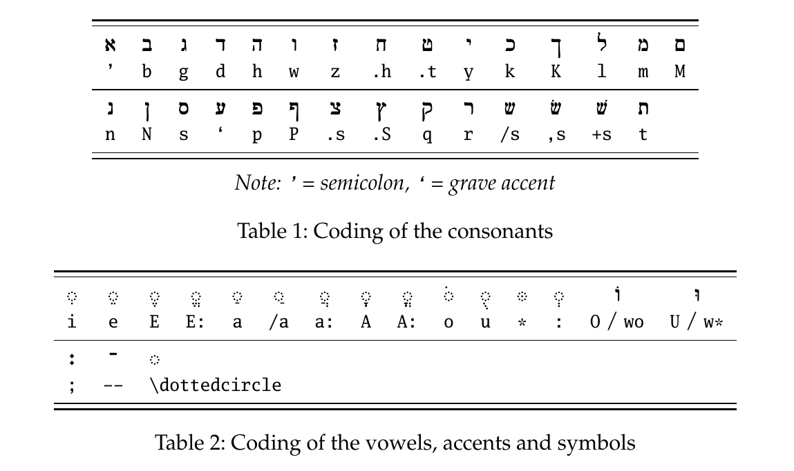

平时工作中英文字母使用最多，但有时还是会碰到其他语言的字母，本文列出相关的输入方法以备查询。

目前列有法语字母、希腊字母与希伯来字母的输入方法。

### 一、环境
- 操作系统：Ubuntu 20.04
- 引擎：XeTeX 3.14159265-2.6-0.999991
  
### 二、完整示例代码
```latex
% 繁星间漫步，陆巍的博客
\documentclass[UTF8, fontset=adobe]{ctexart}

\usepackage{geometry}% 用于页面设置
\usepackage{textgreek}% 希腊字母支持
\usepackage{cjhebrew}% 希伯来文支持

% 设置为A4纸
\geometry{
  a4paper,
  left = 1in,
  right = 1in,
  top = 1in,
  bottom = 1in,
  heightrounded,
}

% ------------------ 开始 -------------------

\begin{document}

\section{法语字母}
这里主要是指如何输入变音符号，下面是示例。
\begin{itemize}
  \item 闭音符：\'e 或者 {\'e}，probl{\`e}me。
  \item 开音符：\`e 或者 {\`e}，{\`e}tat。注意，这个是反单引号。
  \item 长音符：\^e 或者 {\^e}，{\^a}me。
  \item 分音符：\"e 或者 {\"e}，G{\"u}nter。
  \item 软音符：\c c 或者 {\c c}，le{\c c}on。
\end{itemize}


\section{希腊字母}
默认情况下输入希腊字母，需要在数学环境下，例如\verb|$\alpha$|，如果不想在数学环境下，就使用textgreek宏包。平时工作中英文字母使用最多，但有时还是会碰到其他语言的字母，本文列出相关的输入方法以备查询。

目前列有法语字母、希腊字母与希伯来字母的输入方法。

### 一、环境
- 操作系统：Ubuntu 20.04
- 引擎：XeTeX 3.14159265-2.6-0.999991
  
### 二、完整示例代码
```latex
% 繁星间漫步，陆巍的博客
\documentclass[UTF8, fontset=adobe]{ctexart}

\usepackage{geometry}% 用于页面设置
\usepackage{textgreek}% 希腊字母支持
\usepackage{cjhebrew}% 希伯来文支持

% 设置为A4纸
\geometry{
  a4paper,
  left = 1in,
  right = 1in,
  top = 1in,
  bottom = 1in,
  heightrounded,
}

% ------------------ 开始 -------------------

\begin{document}

\section{法语字母}
这里主要是指如何输入变音符号，下面是示例。
\begin{itemize}
  \item 闭音符：\'e 或者 {\'e}，probl{\`e}me。
  \item 开音符：\`e 或者 {\`e}，{\`e}tat。注意，这个是反单引号。
  \item 长音符：\^e 或者 {\^e}，{\^a}me。
  \item 分音符：\"e 或者 {\"e}，G{\"u}nter。
  \item 软音符：\c c 或者 {\c c}，le{\c c}on。
\end{itemize}


\section{希腊字母}
默认情况下输入希腊字母，需要在数学环境下，例如\verb|$\alpha$|，如果不想在数学环境下，就使用textgreek宏包。

\vspace{2ex}
\begin{tabular}{p{2em}|p{2em}|p{2em}|p{2em}|p{2em}|p{2em}|p{2em}|p{2em}}
  \hline
  大写 & 小写 & 大写 & 小写 & 大写 & 小写 & 大写 & 小写\\
  \hline
  A & \textalpha & B & \textbeta & \textGamma & \textgamma & \textDelta & \textdelta\\
  \hline
  E & \textepsilon & Z & \textzeta & H & \texteta & \textTheta & \texttheta\\
  \hline
  I & \textiota & K & \textkappa & \textLambda & \textlambda & M & \textmu\\
  \hline
  N & \textnu & \textXi & \textxi & O & o & \textPi & \textpi\\
  \hline
  P & \textrho & \textSigma & \textsigma & T & \texttau & \textUpsilon & \textupsilon\\
  \hline
  \textPhi & \textphi & X & \textchi & \textPsi & \textpsi & \textOmega & \textomega\\
  \hline
\end{tabular}


\section{希伯来字母}


\subsection{辅音}
\huge
\<' b g d h w z .h .t y>

\<k K l m M n N s ` p>

\<P .s .S q r /s ,s +s t>


\subsection{元音、重音}
\<i e E E: a /a a: A A: o u * : O/wo U/w* ; -- \dottedcircle>
 
\end{document}
```

### 三、生成的pdf内容


### 四、说明
- 不添加其他宏包的情况下，希腊字母是可以直接输入的，但在XeTeX下，需要放在数学环境中才可通过编译。本例中引入了textgreek宏包后，就不用被限制在数学环境下了。
- 希伯来字母需要调用宏包：cjhebrew。
- 因为希伯来文的阅读方向是从右向向左读（和我国古代一样），所以示例的内容与我们的习惯是反方向的。
- 在元音、重音部分，字符显示有问题，大概是字库上的支持问题。只是我本人并不懂希伯来文，并且目前用不上，所以暂时先这样摆着。
- 希伯来辅音字母的前四个，也可以使用数学符号宏包amssymb来输入，命令分别为：\aleph、\beth、\gimel与\daleth。

#### cjhebrew宏包说明文档中的编码参考图：


\vspace{2ex}
\begin{tabular}{p{2em}|p{2em}|p{2em}|p{2em}|p{2em}|p{2em}|p{2em}|p{2em}}
  \hline
  大写 & 小写 & 大写 & 小写 & 大写 & 小写 & 大写 & 小写\\
  \hline
  A & \textalpha & B & \textbeta & \textGamma & \textgamma & \textDelta & \textdelta\\
  \hline
  E & \textepsilon & Z & \textzeta & H & \texteta & \textTheta & \texttheta\\
  \hline
  I & \textiota & K & \textkappa & \textLambda & \textlambda & M & \textmu\\
  \hline
  N & \textnu & \textXi & \textxi & O & o & \textPi & \textpi\\
  \hline
  P & \textrho & \textSigma & \textsigma & T & \texttau & \textUpsilon & \textupsilon\\
  \hline
  \textPhi & \textphi & X & \textchi & \textPsi & \textpsi & \textOmega & \textomega\\
  \hline
\end{tabular}


\section{希伯来字母}


\subsection{辅音}
\huge
\<' b g d h w z .h .t y>

\<k K l m M n N s ` p>

\<P .s .S q r /s ,s +s t>


\subsection{元音、重音}
\<i e E E: a /a a: A A: o u * : O/wo U/w* ; -- \dottedcircle>
 
\end{document}
```

### 三、生成的pdf内容


### 四、说明
- 不添加其他宏包的情况下，希腊字母是可以直接输入的，但在XeTeX下，需要放在数学环境中才可通过编译。本例中引入了textgreek宏包后，就不用被限制在数学环境下了。
- 希伯来字母需要调用宏包：cjhebrew。
- 因为希伯来文的阅读方向是从右向向左读（和我国古代一样），所以示例的内容与我们的习惯是反方向的。
- 在元音、重音部分，字符显示有问题，大概是字库上的支持问题。只是我本人并不懂希伯来文，并且目前用不上，所以暂时先这样摆着。
- 希伯来辅音字母的前四个，也可以使用数学符号宏包amssymb来输入，命令分别为：\aleph、\beth、\gimel与\daleth。

#### cjhebrew宏包说明文档中的编码参考图：
