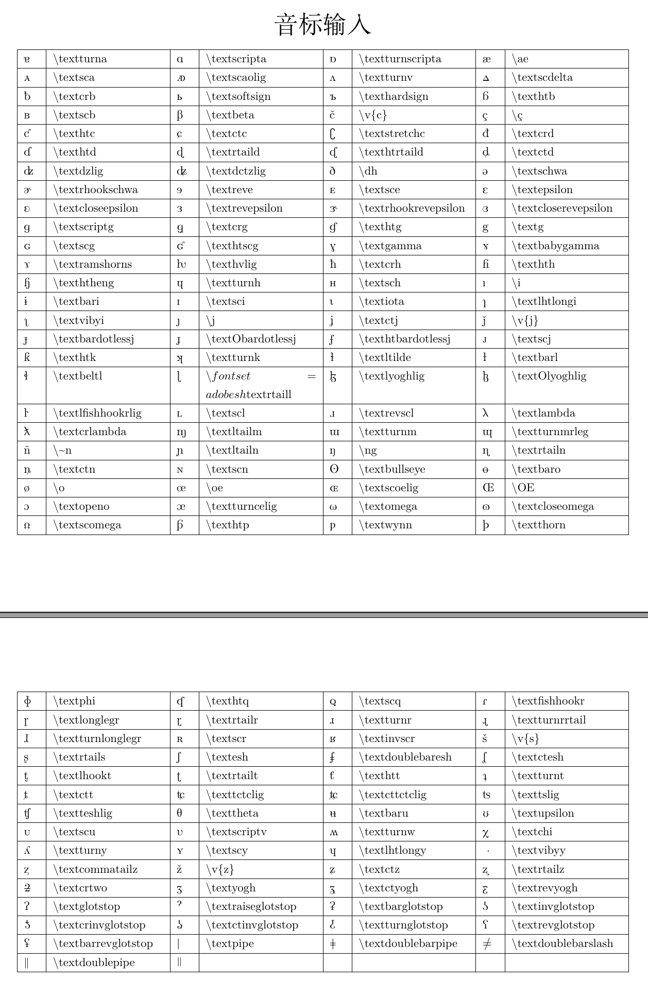

### 一、环境
- 操作系统：Ubuntu 20.04
- 引擎：XeTeX 3.14159265-2.6-0.999991

### 二、完整示例代码
```latex
% 繁星间漫步，陆巍的博客
\documentclass[UTF8]{ctexart}

% 注意宏包顺序，有可能会报错
\usepackage{tipx}% 这里用于支持音标显示
\usepackage{geometry}% 用于页面设置
\usepackage{longtable}% 支持长表格跨页

% 设置纸张与边距
\geometry{
  a4paper,
  left = 20mm,
  right = 20mm,
  top = 20mm,
  bottom = 20mm,
  landscape % 纸张横向
}

\begin{document}
\begin{center}
\huge 音标输入\normalsize\\

\begin{longtable}{|p{5mm}|p{35mm}|p{5mm}|p{35mm}|p{5mm}|p{35mm}|p{5mm}|p{35mm}|}
\hline
\textturna & $\backslash$textturna & \textscripta & $\backslash$extscripta & \textturnscripta & $\backslash$textturnscripta & \ae & $\backslash$ae\\
\hline
\textsca & $\backslash$textsca & \textscaolig & $\backslash$textscaolig & \textturnv & $\backslash$textturnv & \textscdelta & $\backslash$textscdelta \\
\hline
\textcrb & $\backslash$textcrb & \textsoftsign & $\backslash$textsoftsign & \texthardsign & $\backslash$texthardsign & \texthtb & $\backslash$texthtb\\
\hline
\textscb & $\backslash$textscb & \textbeta & $\backslash$textbeta & \v{c} & $\backslash$v\{c\}& \c{c} & $\backslash$\c{c}\\
\hline
\texthtc & $\backslash$texthtc & \textctc & $\backslash$textctc & \textstretchc & $\backslash$textstretchc & \textcrd & $\backslash$textcrd\\
\hline
\texthtd & $\backslash$texthtd & \textrtaild & $\backslash$textrtaild & \texthtrtaild & $\backslash$texthtrtaild & \textctd & $\backslash$textctd\\
\hline
\textdzlig & $\backslash$textdzlig & \textdctzlig & $\backslash$textdctzlig & \dh & $\backslash$dh & \textschwa & $\backslash$textschwa\\
\hline
\textrhookschwa & $\backslash$textrhookschwa & \textreve & $\backslash$textreve & \textsce & $\backslash$textsce & \textepsilon & $\backslash$textepsilon\\
\hline
\textcloseepsilon & $\backslash$textcloseepsilon & \textrevepsilon & $\backslash$textrevepsilon & \textrhookrevepsilon & $\backslash$textrhookrevepsilon & \textcloserevepsilon & $\backslash$textcloserevepsilon\\
\hline
\textscriptg & $\backslash$textscriptg & \textcrg & $\backslash$textcrg & \texthtg & $\backslash$texthtg & \textg & $\backslash$textg\\
\hline
\textscg & $\backslash$textscg & \texthtscg & $\backslash$texthtscg & \textgamma & $\backslash$textgamma & \textbabygamma & $\backslash$textbabygamma\\
\hline
\textramshorns & $\backslash$textramshorns & \texthvlig & $\backslash$texthvlig &
\textcrh & $\backslash$textcrh & \texthth & $\backslash$texthth\\
\hline
\texththeng & $\backslash$texththeng & \textturnh & $\backslash$textturnh & \textsch & $\backslash$textsch & \i & $\backslash$i\\
\hline
\textbari & $\backslash$textbari & \textsci & $\backslash$textsci & \textiota & $\backslash$textiota & \textlhtlongi & $\backslash$textlhtlongi\\
\hline
\textvibyi & $\backslash$textvibyi & \j & $\backslash$j & \textctj & $\backslash$textctj & \v{j} & $\backslash$v\{j\}\\
\hline
\textbardotlessj & $\backslash$textbardotlessj & \textObardotlessj & $\backslash$textObardotlessj & \texthtbardotlessj & $\backslash$texthtbardotlessj & \textscj & $\backslash$textscj\\
\hline
\texthtk & $\backslash$texthtk & \textturnk & $\backslash$textturnk & \textltilde & $\backslash$textltilde & \textbarl & $\backslash$textbarl\\
\hline
\textbeltl & $\backslash$textbeltl & \textrtaill & $\backslash$textrtaill & \textlyoghlig & $\backslash$textlyoghlig & \textOlyoghlig & $\backslash$textOlyoghlig\\
\hline
\textlfishhookrlig & $\backslash$textlfishhookrlig & \textscl & $\backslash$textscl & \textrevscl & $\backslash$textrevscl &
\textlambda & $\backslash$textlambda\\
\hline
\textcrlambda & $\backslash$textcrlambda & \textltailm & $\backslash$textltailm & \textturnm & $\backslash$textturnm & \textturnmrleg & $\backslash$textturnmrleg\\
\hline
\~n & $\backslash$\textasciitilde n & \textltailn & $\backslash$textltailn & \ng & $\backslash$ng & \textrtailn & $\backslash$textrtailn\\
\hline
\textctn & $\backslash$textctn & \textscn & $\backslash$textscn & \textbullseye & $\backslash$textbullseye & \textbaro & $\backslash$textbaro\\
\hline
\o & $\backslash$o & \oe & $\backslash$oe & \textscoelig & $\backslash$textscoelig & \OE & $\backslash$OE\\
\hline
\textopeno & $\backslash$textopeno & \textturncelig & $\backslash$textturncelig & \textomega & $\backslash$textomega & \textcloseomega & $\backslash$textcloseomega\\
\hline
\textscomega & $\backslash$textscomega & \texthtp & $\backslash$texthtp & \textwynn & $\backslash$textwynn & \textthorn & $\backslash$textthorn\\
\hline
\textphi & $\backslash$textphi & \texthtq & $\backslash$texthtq & \textscq & $\backslash$textscq & \textfishhookr & $\backslash$textfishhookr\\
\hline
\textlonglegr & $\backslash$textlonglegr & \textrtailr & $\backslash$textrtailr &
\textturnr & $\backslash$textturnr & \textturnrrtail & $\backslash$textturnrrtail\\
\hline
\textturnlonglegr & $\backslash$textturnlonglegr & \textscr & $\backslash$textscr & \textinvscr & $\backslash$textinvscr & \v{s} & $\backslash$v\{s\}\\
\hline
\textrtails & $\backslash$textrtails & \textesh & $\backslash$textesh & \textdoublebaresh & $\backslash$textdoublebaresh & \textctesh & $\backslash$textctesh\\
\hline
\textlhookt & $\backslash$textlhookt & \textrtailt & $\backslash$textrtailt & \texthtt & $\backslash$texthtt & \textturnt & $\backslash$textturnt\\
\hline
\textctt & $\backslash$textctt & \texttctclig & $\backslash$texttctclig & \textcttctclig & $\backslash$textcttctclig & \texttslig & $\backslash$texttslig\\
\hline
\textteshlig & $\backslash$textteshlig & \texttheta & $\backslash$texttheta & \textbaru & $\backslash$textbaru & \textupsilon & $\backslash$textupsilon\\
\hline
\textscu & $\backslash$textscu & \textscriptv & $\backslash$textscriptv & \textturnw & $\backslash$textturnw & \textchi & $\backslash$textchi\\
\hline
\textturny & $\backslash$textturny & \textscy & $\backslash$textscy & \textlhtlongy & $\backslash$textlhtlongy & \textvibyy & $\backslash$textvibyy\\
\hline
\textcommatailz & $\backslash$textcommatailz & \v{z} & $\backslash$v\{z\} & \textctz & $\backslash$textctz & \textrtailz & $\backslash$textrtailz\\
\hline
\textcrtwo & $\backslash$textcrtwo & \textyogh & $\backslash$textyogh & \textctyogh & $\backslash$textctyogh & \textrevyogh & $\backslash$textrevyogh\\
\hline
\textglotstop & $\backslash$textglotstop & \textraiseglotstop & $\backslash$textraiseglotstop & \textbarglotstop & $\backslash$textbarglotstop & \textinvglotstop & $\backslash$textinvglotstop\\
\hline
\textcrinvglotstop & $\backslash$textcrinvglotstop & \textctinvglotstop & $\backslash$textctinvglotstop & \textturnglotstop & $\backslash$textturnglotstop & \textrevglotstop & $\backslash$textrevglotstop\\
\hline
\textbarrevglotstop & $\backslash$textbarrevglotstop & \textpipe & $\backslash$textpipe & \textdoublebarpipe & $\backslash$textdoublebarpipe & \textdoublebarslash & $\backslash$textdoublebarslash\\
\hline
\textdoublepipe & $\backslash$textdoublepipe & \textdoublepipevar &&&&&\\
\hline
\end{longtable}
\end{center}
 
\end{document}
```

### 三、生成的pdf内容


### 四、说明
- 这里使用的关键宏包是tipx宏包，注意不是tipa宏包。
- 因为表格过长，所以在示例中调用了支持长表格跨页的宏包longtable。
- 对于这个环境下不能显示、重复、报错，以及可以由键盘直接输入的符号，这里不列出。详情可查询tipx宏包帮助文件。
- 示例的latex代码编译后，会有一些警告信息，例如这样的“Font shape `T3/lmr/m/n' undefined”，不用理会，不会影响什么。