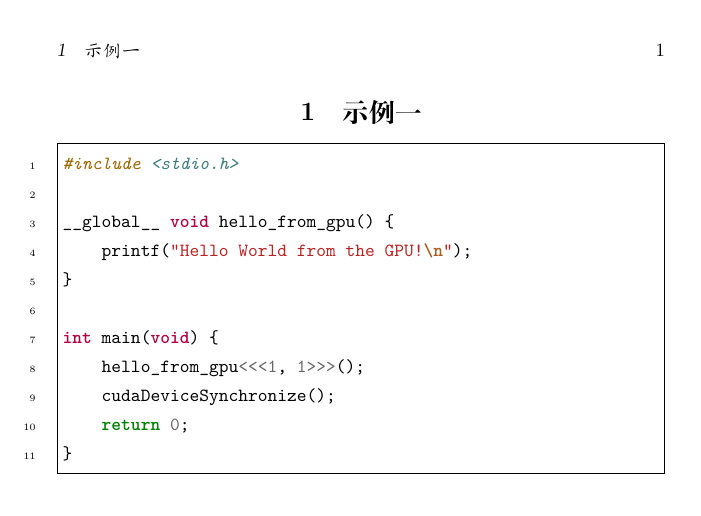

## 使用宏包minted在LaTeX中显示程序代码

---

通常在LaTeX中展示代码，我们最先接触到的宏包是listings，本文介绍另外一个能实现相同功能的宏包——minted。

环境
---
操作系统：Ubuntu 22.04.3

编辑工具：TeXstudio 4.2.1

编译方式：XeLaTeX

---

### 1. 准备工作：

#### 1.1 安装来自python的相关支持库

执行以下命令：
```
sudo apt install python3-pip
sudo pip3 install pygments
```
我们可以通过命令 pygmentize -L lexers 来列出其支持的语言。

#### 1.2 在 LaTeX 编译命令中增加参数

在命令中加入参数：-shell-escape

我使用的是XeLaTeX，完整的命令如下：
```
xelatex -synctex=1 -interaction=nonstopmode -shell-escape %.tex
```

### 2. 示例

#### 2.1 完整源代码

```latex
% 繁星间漫步，陆巍的博客
\documentclass{ctexart}

\usepackage{minted}% 更好的代码高亮显示。查看支持语言的命令是 pygmentize -L lexers

% ------------------ 开始 -------------------
\begin{document}
\section{示例一}
\begin{minted}[linenos=true,frame=single,breaklines]{c}
#include <stdio.h>

__global__ void hello_from_gpu() {
    printf("Hello World from the GPU!\n");
}

int main(void) {
    hello_from_gpu<<<1, 1>>>();
    cudaDeviceSynchronize();
    return 0;
}
\end{minted}

% 从外部文件导入代码
\inputminted[linenos=true,frame=single,breaklines]{c}{main.cu}
\end{document}
```

#### 2.2 效果


从外部文件导入代码这条的生成效果没有列出来，因为内容太多，太占篇幅。

#### 2.3 参数说明
这里指的是\begin{minted}命令后中括号内的参数。中括号后面的大括号里面是编程语言名称。

* breaklines：表示自动换行
* frame：设置边框的样式，其他可选项包括 lines、leftline, topline, bottomline 等。
* linenos：设置是否显示代码的行号。


#### 2.4 其他说明
* 从外部文件导入代码，在参数设置上与直接列出代码的一样。只是要注意路径问题，如果不方便像本例这样在同一个文件夹下的话（实际上，同一目录下的情况非常少，一般都会在外部），可以使用软链接来指向。
