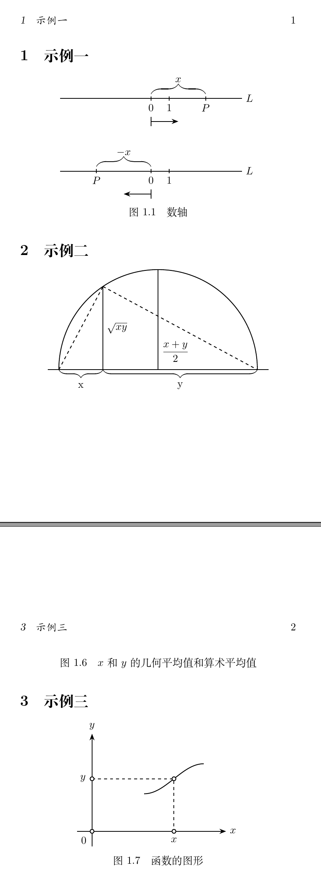

## LaTeX绘制数学类图形备忘一
---

为了方便以后在LaTeX中绘制数学类图形，特编写本文。以下示例中的图形来自《微积分和数学分析引论》。

### 一、示例代码的验证环境
- Ubuntu 22.04
- XeTeX 3.141592653-2.6-0.999993

### 二、完整示例代码
```latex
% 繁星间漫步，陆巍的博客
\documentclass[UTF8,a5paper]{ctexart}
\usepackage{tikz}% 绘图支持

\usetikzlibrary{arrows.meta,decorations,calligraphy}

% 设置章节标题左对齐，+=表示在原有格式上追加，如果只有=则表示完全替换
\ctexset{
  section/format += \raggedright,
  subsection/format += \raggedright,
  subsubsection/format += \raggedright,
}

% tikz图形样式定义
\tikzset{
  dot/.style = {
      draw,
      fill = white,
      circle,
      inner sep = 0pt,
      minimum size = 4pt,
  }
}

\begin{document}
\section{示例一}
\begin{center}
  \def\U{*0.033*\textwidth}
  \begin{tikzpicture}[thick]
    % 绘制轴
    \draw(-10\U,0)--(10\U,0) coordinate[label={right:$L$}](xmax);
    % 绘制轴上的点
    \foreach \x/\xtext in{0/0,2\U/1,6\U/P}
      \draw[shift={(\x,0)}](0pt,2pt)--(0pt,-2pt)node[below]{$\xtext$};
    % 绘制范围括号
    \draw[decorate,decoration={calligraphic brace,amplitude=10pt}](0,1ex)
      --node[yshift=3ex]{$x$}++(6\U,0);
    % 绘制方向指示
    \draw(0,-4ex)--++(0,-2ex);
    \draw[-{Stealth}](0,-5ex)--++(3\U,0);
  \end{tikzpicture}
  
  \vspace{4ex}
  \begin{tikzpicture}[thick]
    % 绘制轴
    \draw(-10\U,0)--(10\U,0) coordinate[label={right:$L$}](xmax);
    % 绘制轴上的点
    \foreach \x/\xtext in{-6\U/P,0/0,2\U/1}
      \draw[shift={(\x,0)}](0pt,2pt)--(0pt,-2pt)node[below]{$\xtext$};
    % 绘制范围括号
    \draw[decorate,decoration={calligraphic brace,amplitude=10pt}](-6\U,1ex)
      --node[yshift=3ex]{$-x$}(0,1ex);
    % 绘制方向指示
    \draw(0,-4ex)--++(0,-2ex);
    \draw[-{Stealth}](0,-5ex)--++(-3\U,0);
  \end{tikzpicture}

  图1.1\quad 数轴
\end{center}


\section{示例二}
\begin{center}
  \begin{tikzpicture}[thick]
    \def\U{*0.04*\textwidth}
    \draw(-1\U,0)--(19\U,0) coordinate(xmax);
    \draw(0,0) arc[start angle=180,end angle=0,x radius=9\U,y radius=9\U];
    % 计算c点y坐标值
    \pgfmathparse{sqrt(4*14)}
    \path
      coordinate (c) at (4\U,\pgfmathresult\U);
    \draw(9\U,0)--node[yshift=-7ex,right]{$\displaystyle\frac{x+y}{2}$}++(0,9\U);
    \draw(4\U,0)--node[right]{$\sqrt{xy}$}(c);
    \draw[dashed](0,0)--++(c);
    \draw[dashed](c)--(18\U,0);
    \draw[decorate,decoration={calligraphic brace,amplitude=8pt}](4\U,0)--node[yshift=-3.5ex]{x}(0,0);
    \draw[decorate,decoration={calligraphic brace,amplitude=8pt}](18\U,0)--node[yshift=-3.5ex]{y}(4\U,0);
  \end{tikzpicture}
  
  图1.6\quad $x$和$y$的几何平均值和算术平均值
\end{center}


\section{示例三}
\begin{center}
  \begin{tikzpicture}[thick]
    \def\U{*0.027*\textwidth}
    % 绘制坐标轴
    \draw[-{Stealth}](-2\U,0)--(18\U,0) coordinate[label={right:$x$}];
    \draw[-{Stealth}](0,-2\U)--(0,13\U) coordinate[label={above:$y$}];
    % 设定坐标点
    \path
      coordinate(x) at (11\U,0)
      coordinate(y) at (0,7\U)
      coordinate(c) at (11\U,7\U)
      coordinate(c1) at (7\U,5\U)
      coordinate(c2) at (15\U,9\U);
    \draw[dashed](y)--(c)--(x);
    % 绘制曲线
    \draw(7\U,5\U) cos(11\U,7\U) sin(15\U,9\U);
    % 绘制各点标签
    \draw
      (y)node[dot,label={left:$y$}]{}
      (c)node[dot]{}
      (x)node[dot,label={below:$x$}]{}
      (0,0)node[dot,label={below left:$0$}]{};
  \end{tikzpicture}
  
  图1.7\quad 函数的图形
\end{center}

\end{document}
```

### 三、效果


### 四、说明
- 绘制坐标轴使用\draw...coordinate...来实现。
- 使用\foreach命令可以灵活方便的在坐标轴上做标记。
- 绘制表示范围的括号时，如果坐标是从左到右，则括号指向上；如果坐标设成从右到左，则括号指向下。
- 在示例三中，先绘制虚线，后绘制圆点是为了防止虚线显示在圆点上。
- 在示例三中，之所以没有把圆点与虚线放在一个语句上，是因为 dashed 参数会影响圆点的绘制，会造成圆点也变成用虚线绘制，所以要分开写。
- 从代码中可以看到，我在每次开始绘图前都定义了一个基本尺寸单元（例如：\def\U{*0.033*\textwidth}），这样可以方便后面的坐标确定。
- 注意 \foreach 命令：
```latex
\foreach \x/\xtext in{0/0,2\U/1,6\U/P}
      \draw[shift={(\x,0)}](0pt,2pt)--(0pt,-2pt)node[below]{$\xtext$};
```
语句最后的显示标签语句使用了数学模式，因此如果我们显示的标签中是数学公式就不需要再用“\$”符号围起来，否则还有可能出错。
- 注意箭头样式“-{Stealth}”，需要 tikz 中的 arrows.meta 库支持。
- 在示例二、三中，使用了命令 \path，可以用来设置指定坐标的点，这样做对后面绘图中的坐标确定会带来很大的方便。
- 示例二中的 \pgfmathparse 命令，可用来计算数学公式，但其返回值是交给了 \pgfmathresult 命令。因此要使用计算结果，只能调用 \pgfmathresult 命令。很显然，使用 \pgfmathparse 等相关命令为我们绘制数学类图形提供了很大的方便。
- 示例三中为了绘制相关图形调用了余弦、正弦函数，绘制这样的图形有多种方法，因为这里只是简单演示，所以使用了这个最简单的方法。
- 在 node 语句中，我们看到在显示文字标签时，既可以在 node 的后面使用大括号，也可以在可选参数中使用 label 参数来设定，二者有一些差别，请自行比较。