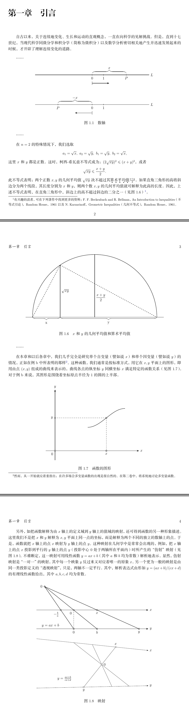
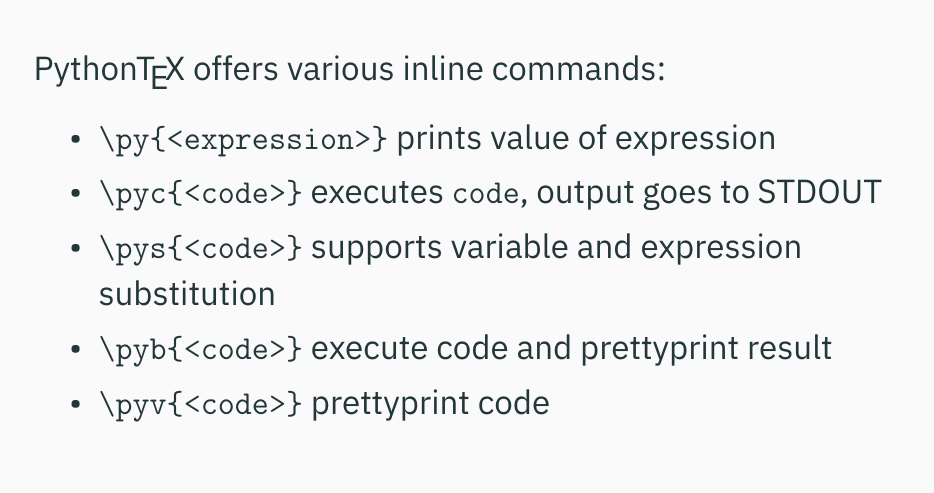

hh# LaTeX简单综合示例一

本文介绍一个简单的 LaTeX 综合示例，内容涉及自定义宏包、读取文件、调用 Python 代码等。

### 一、环境
- Ubuntu 22.04
- XeTeX 3.141592653-2.6-0.999993
- PythonTeX 0.18

### 二、目录结构
```
.
├── 综合示例一.tex
├── figure_lib.tex
├── latex_python -> /home/youling/tree/backyard/latex_python/
└── part1.tex
```
其中的 latex_python 是一个软链接，指向的是存放 Python 代码的文件夹。本例中会调用自定义宏包，相关定义方法与调用路径问题请看我的另一篇博客“LaTeX中自定义宏包的方法和路径问题”。LaTeX 中的默认搜索路径“~/texmf/tex/latex/commonstuff”只支持 LaTeX 的宏包文件，对于 Python 代码中的调用路径无效，所以要使用软链接。

### 三、LaTeX 代码

#### 1、begonia.sty
```latex
% 繁星间漫步，陆巍的博客
\NeedsTeXFormat{LaTeX2e}
\ProvidesPackage{begonia}[2022-09-23 本文档中用tikz绘制的图形库]

\RequirePackage{tikz}% 绘图支持
\RequirePackage{pythontex}% python支持
\RequirePackage{catchfilebetweentags}% 从文件读取部分内容

% 加入需要使用的tikz绘图库
\usetikzlibrary{arrows.meta,decorations,calligraphy}

% tikz图形样式定义
\tikzset{
  dot/.style = {
      draw,
      fill = white,
      circle,
      inner sep = 0pt,
      minimum size = 4pt,
  }
}

\begin{pycode}
from latex_python.latex.latex_math import latex_math

\end{pycode}
```

#### 2、综合示例一.tex
```latex
% 繁星间漫步，陆巍的博客
\documentclass[UTF8,oneside,fontset=founder,12pt]{ctexbook}

\usepackage[dvipsnames, svgnames, x11names]{xcolor}% 颜色支持
\usepackage{graphicx}% 图形支持
\usepackage[
  colorlinks=true,
  linkcolor=Navy,
  urlcolor=Navy,
  citecolor=Navy,
  anchorcolor=Navy
]{hyperref}% 设置超链接颜色
\usepackage{ulem}% 各种类型的下划线
\usepackage[
  a4paper,
  left=10mm,
  right=10mm,
  bottom=15mm,
]{geometry}% 页面设置
\usepackage{xeCJKfntef}% 提供中日韩文字的排版功能。本文用于在汉字下加点。
\usepackage{amsmath}% 数学支持
\usepackage{amssymb}% 数学符号

\usepackage{latex_package/begonia}% 自定义tikz声明区宏包

% 加粗文字下面的点
\xeCJKsetup{underdot/symbol=\bfseries^^b7}

% 设置章节标题左对齐，+=表示在原有格式上追加，如果只有=则表示完全替换
\ctexset{
  chapter/format += \raggedright,
  section/format += \raggedright,
  subsection/format += \raggedright,
  subsubsection/format += \raggedright,
}

\setlength{\parindent}{2em}% 缩进
\setlength{\parskip}{2ex} % 段间距


% ------------------ 开始 -------------------
\begin{document}

% ------------------ 封面 -------------------
\begin{titlepage}
  \begin{center}
    \huge\textbf{LaTeX 综合示例一}\normalsize
  \end{center}
  
\end{titlepage}

% ------------------ 前言 -------------------
\frontmatter% 关闭前言部分的章节序号，页码使用罗马数字


\chapter{序言}
十七世纪后期，出现了一个崭新的数学分支——数学分析。它在数学领域中占据着主导地位。这种新数学思想的特点是，非常成功地运用了无限过程的运算即极限运算。而其中的微分和积分这两个过程，则构成系统微分学和积分学（通常简称为微积分）的核心，并奠定了全部分析学的基础。

……

我们希望目前这本新的者作，对于年轻的一代科学家将有所助益。我们深知本书有许多不足之处，因此，诚恳地欢迎批评指正，这对于本书今后的修订会有好处。

\hfill R.\itshape 柯朗，\normalfont F.\itshape 约翰\normalfont

\hfill 1965年6月

% ------------------ 目录 -------------------
\tableofcontents% 生成目录


% ------------------ 正文 -------------------
\mainmatter

\input{part1}

\end{document}
```

#### 3、part1.tex
```latex
% 繁星间漫步，陆巍的博客
part{第一卷}


\chapter{引言}
自古以来，关于连续地变化、生长和运动的直观概念，一直在向科学的见解挑战。但是，直到十七世纪，当现代科学同微分学和积分学（简称为微积分）以及数学分析密切相关地产生并迅速发展起来的时候，才开辟了理解连续变化的道路。

……

\ExecuteMetaData[figure_lib.tex]{figure1.1}

……

在$n=2$的特殊情况下，我们选取
$$
a_1=\sqrt{x},\ a_2=\sqrt{y},\ b_1=\sqrt{y},\ b_2=\sqrt{x},
$$
这里$x$和$y$都是正数。这时，柯西-希瓦兹不等式成为：$(2\sqrt{xy})^2\leqslant(x+y)^2$，或者
$$
\sqrt{xy}\leqslant\frac{x+y}{2}.
$$
此不等式表明：两个正数$x,y$的几何平均值$\sqrt{xy}$决不超过其\CJKunderdot{算术平均值}$\frac{x+y}{2}$。如果直角三角形的高将斜边分为两个线段，其长度分别为$x$和$y$，则两个数$x,y$的几何平均值就可解释为此高的长度。因此，上述不等式表明，在直角三角形中，斜边上的高不超过斜边的二分之一（见图1.6）\footnote{有兴趣的读者，可在下列著作中找到更多的资料：F. F. Beckenbach and R. Bellman，An Introduction to lnequalities（不等式引论），Random House，1961以及 N. Karzarinoff，Geometric Inequalities（几何不等式），Random House，1961。}。

\ExecuteMetaData[figure_lib.tex]{figure1.6}

……

在本章和以后各章中，我们几乎完全是研究单个自变量（譬如说$x$）和单个因变量（譬如说$y$）的情况，正如在例b中所表明的那样\footnote{然而，从一开始就应着重指出：在许多场合多变量函数的出现是很自然的。在第二卷中，将系统地讨论多变量函数。}。这种函数，我们通常是按标准方式，用它在$x,y$平面上的图形，即用由点$(x,y)$组成的曲线来表示的，曲线各点的纵坐标$y$同横坐标$x$满足特定的函数关系（见图1.7）。对于例b来说，其图形是围绕着坐标原点半径为1的圆的上半部。

\ExecuteMetaData[figure_lib.tex]{figure1.7}

另外，如把函数解释为由$x$轴上的定义域到$y$轴上的值域的映射，还可得到函数的另一种形象描述。这里我们不是把$x$和$y$解释为$x,y$平面上同一点的坐标，而是解释为两个不同的独立的数轴上的点。于是，函数就把$x$轴上的点$x$映射为$y$轴上的点$y$。这种映射在几何学中是常常会出现的，例如，把$x$轴上的点$x$投影到平行的$y$轴上的点$y$（投影中心0处于两轴所在平面内）时所产生的“仿射”映射（见图1.8）。不难断定，这一映射可用线性函数$y=ax+b$（其中$a$和$b$均为常数）解析地表示。显然，仿射映射是“一对一”的映射，其中每一个映象$y$反过来又对应着唯一的原象$x$。另一个更为一般的映射是由同一类投影定义的“透视映射”，只是，两轴不一定平行。其中，解析表达式由形如$y=(ax+b)/(cx+d)$的有理线性函数给出，其中$a,b,c,d$均为常数。

\ExecuteMetaData[figure_lib.tex]{figure1.8}

```

#### 4、figure_lib.tex
```latex
% 繁星间漫步，陆巍的博客
\documentclass[UTF8,oneside,fontset=founder,12pt]{ctexbook}

\usepackage[dvipsnames, svgnames, x11names]{xcolor}% 颜色支持
\usepackage[
  colorlinks=true,
  linkcolor=Navy,
  urlcolor=Navy,
  citecolor=Navy,
  anchorcolor=Navy
]{hyperref}% 设置超链接颜色
\usepackage[
  a4paper,
  left=10mm,
  right=10mm,
  bottom=15mm,
]{geometry}% 页面设置
\usepackage{latex_package/begonia}% 自定义tikz声明区宏包
\usepackage{amssymb}% 数学符号

% 设置章节标题左对齐，+=表示在原有格式上追加，如果只有=则表示完全替换
\ctexset{
  chapter/format += \raggedright,
  section/format += \raggedright,
  subsection/format += \raggedright,
  subsubsection/format += \raggedright,
}

\begin{document}


% ------------------ 目录 -------------------
\tableofcontents% 生成目录


\chapter{引言}


\section{实数连续统}


\subsection{图1.1}
%<*figure1.1>
\begin{center}
  \def\U{*0.033*\textwidth}
  \begin{tikzpicture}[thick]
    % 绘制轴
    \draw(-10\U,0)--(10\U,0) coordinate[label={right:$L$}](xmax);
    % 绘制轴上的点
    \foreach \x/\xtext in{0/0,2\U/1,6\U/P}
      \draw[shift={(\x,0)}](0pt,2pt)--(0pt,-2pt)node[below]{$\xtext$};
    % 绘制范围括号
    \draw[decorate,decoration={calligraphic brace,amplitude=10pt}](0,1ex)
      --node[yshift=3ex]{$x$}++(6\U,0);
    % 绘制方向指示
    \draw(0,-4ex)--++(0,-2ex);
    \draw[-{Stealth}](0,-5ex)--++(3\U,0);
  \end{tikzpicture}\\[2ex]
  
  \vspace{4ex}
  \begin{tikzpicture}[thick]
    % 绘制轴
    \draw(-10\U,0)--(10\U,0) coordinate[label={right:$L$}](xmax);
    % 绘制轴上的点
    \foreach \x/\xtext in{-6\U/P,0/0,2\U/1}
      \draw[shift={(\x,0)}](0pt,2pt)--(0pt,-2pt)node[below]{$\xtext$};
    % 绘制范围括号
    \draw[decorate,decoration={calligraphic brace,amplitude=10pt}](-6\U,1ex)
      --node[yshift=3ex]{$-x$}(0,1ex);
    % 绘制方向指示
    \draw(0,-4ex)--++(0,-2ex);
    \draw[-{Stealth}](0,-5ex)--++(-3\U,0);
  \end{tikzpicture}\\[2ex]

  图1.1\quad 数轴
\end{center}
%</figure1.1>


\subsection{图1.6}
%<*figure1.6>
\begin{center}
\begin{tikzpicture}[thick]
  \def\U{*0.04*\textwidth}
  \draw(-1\U,0)--(19\U,0) coordinate(xmax);
  \draw(0,0) arc[start angle=180,end angle=0,x radius=9\U,y radius=9\U];
  % 计算c点y坐标值
  \pgfmathparse{sqrt(4*14)}
  \path
    coordinate (c) at (4\U,\pgfmathresult\U);
  \draw(9\U,0)--node[yshift=-7ex,right]{$\displaystyle\frac{x+y}{2}$}++(0,9\U);
  \draw(4\U,0)--node[right]{$\sqrt{xy}$}(c);
  \draw[dashed](0,0)--++(c);
  \draw[dashed](c)--(18\U,0);
  \draw[decorate,decoration={calligraphic brace,amplitude=8pt}](4\U,0)--node[yshift=-3.5ex]{x}(0,0);
  \draw[decorate,decoration={calligraphic brace,amplitude=8pt}](18\U,0)--node[yshift=-3.5ex]{y}(4\U,0);
\end{tikzpicture}\\[2ex]

图1.6\quad $x$和$y$的几何平均值和算术平均值
\end{center}
%</figure1.6>


\section{函数的概念}


\subsection{图1.7}
%<*figure1.7>
\begin{center}
\begin{tikzpicture}[thick]
  \def\U{*0.027*\textwidth}
  % 绘制坐标轴
  \draw[-{Stealth}](-2\U,0)--(18\U,0) coordinate[label={right:$x$}];
  \draw[-{Stealth}](0,-2\U)--(0,13\U) coordinate[label={above:$y$}];
  % 设定坐标点
  \path
    coordinate(x) at (11\U,0)
    coordinate(y) at (0,7\U)
    coordinate(c) at (11\U,7\U)
    coordinate(c1) at (7\U,5\U)
    coordinate(c2) at (15\U,9\U);
  \draw[dashed](y)--(c)--(x);
  % 绘制曲线
  \draw(7\U,5\U) cos(11\U,7\U) sin(15\U,9\U);
  % 绘制各点标签
  \draw
    (y)node[dot,label={left:$y$}]{}
    (c)node[dot]{}
    (x)node[dot,label={below:$x$}]{}
    (0,0)node[dot,label={below left:$0$}]{};
\end{tikzpicture}\\[2ex]

图1.7\quad 函数的图形
\end{center}
%</figure1.7>


\subsection{图1.8}
%<*figure1.8>
\begin{center}
\begin{tikzpicture}[thick]
  \def\U{*0.027*\textwidth}
  \pyc{xa, ya, _ = latex_math("linear_equation_in_two_unknowns;5,4,14,0,0,4,5,0;Xa,Ya")}
  \draw[-{Stealth}](-8\U,4\U)--(16\U,4\U) coordinate[label={right:$x$}];
  \draw[-{Stealth}](-8\U,0)--(16\U,0) coordinate[label={right:$y$}];
  \path
    coordinate(x) at (5\U,4\U)
    coordinate(b) at (5\U,0)
    coordinate(y) at (14\U,0)
    % 计算x-y线与b-0（x轴原点，实际制图坐标是（0,4\U））线的交叉点
    coordinate(z) at (\Xa\U,\Ya\U);
  \draw[dashed](0,4\U)--(0,0);
  \draw(z)--(y)node[dot,label={below:$y$}]{};
  \draw(z)--(b)node[dot,label={below:$b$}]{};
  \draw(z)node[dot,label={left:0}]{}--(0,0)node[dot,label={below:0}]{};
  % 计算z-0（y轴原点）直线与x轴的交叉点
  \pyc{latex_math("linear_equation_with_one_unknown;1,4," + str(xa) + "," + str(ya) + ",0,0;Xb")}
  \draw
    (0,4\U)node[dot,label={below left:$0$}]{}
    (x)node[dot,label={below:$x$}]{}
    (\Xb\U,4\U)node[dot,label={below left:$-\frac{b}{a}$}]{};
  \draw(-5\U,0.7\U)node{$y=ax+b$};
\end{tikzpicture}\\[2ex]

\begin{tikzpicture}
  \def\U{*0.027*\textwidth}
  \draw[-{Stealth}](-14\U,5.5\U)--(10\U,3\U) coordinate[label={right:$x$}](xmax);
  \draw[-{Stealth}](-14\U,-5\U)--(10\U,-4.5\U) coordinate[label={right:$y$}](xmax);
  % 已知横坐标计算纵坐标
  % X点
  \pyc{y0, _ = latex_math("linear_equation_with_one_unknown;0,3,-14,5.5,10,3;Ya")}
  % x1点
  \pyc{y1, _ = latex_math("linear_equation_with_one_unknown;0,-6,-14,5.5,10,3;Yb")}
  % x2点
  \pyc{y2, _ = latex_math("linear_equation_with_one_unknown;0,-2,-14,5.5,10,3;Yc")}
  % 通过x、x1、x2与原点（z）的直线与y轴计算交点
  \pyc{latex_math("linear_equation_in_two_unknowns;3," + str(y0) + ",0,0,-14,-5,10,-4.5;Xaa,Yaa")}
  \pyc{latex_math("linear_equation_in_two_unknowns;-6," + str(y1) + ",0,0,-14,-5,10,-4.5;Xba,Yba")}
  \pyc{latex_math("linear_equation_in_two_unknowns;-2," + str(y2) + ",0,0,-14,-5,10,-4.5;Xca,Yca")}
  % 设置好要用到的坐标点，方便后面调用。
  \path
    coordinate (z) at (0, 0)
    coordinate (x) at (3\U,\Ya\U)
    coordinate (y) at (\Xaa\U,\Yaa\U)
    coordinate (x1) at (-6\U,\Yb\U)
    coordinate (y1) at (\Xba\U,\Yba\U)
    coordinate (x2) at (-2\U,\Yc\U)
    coordinate (y2) at (\Xca\U,\Yca\U);
  \draw(x)node[dot,label={$x$}]{}--(y)node[dot,label={below:$y$}]{};
  \draw(x1)--(y1);
  \draw(x2)--(y2);
  \draw(z)node[dot,label={right:0}]{};
  \draw(-8\U,-3\U)node{$y=\frac{ax+b}{cx+d}$};
\end{tikzpicture}\\[2ex]

图1.8\quad 映射
\end{center}
%</figure1.8>

\end{document}
```

### 四、Python 代码
```
.
├── __init__.py
├── latex
│   ├── __init__.py
│   └── latex_math.py
├── math_lib
│   ├── __init__.py
│   └── linear_equation.py
├── test
└── venv
```
其中的 test 是测试文件夹，venv 是虚拟环境文件夹，与本文关系不大，这里不作介绍。

#### 1、根目录下的__init__.py
```python
from latex_python import file_lib
from latex_python import latex
from latex_python import math_lib
from latex_python import test
```

#### 2、latex/__init__.py
```python
from latex_python.latex import latex_math
```

#### 3、latex/latex_math.py
```python
# _*_ coding: utf8
from latex_python.math_lib.linear_equation import (
    linear_equation_with_one_unknown,
    linear_equation_in_two_unknowns,
)


def latex_math(latex_str):
    groups = latex_str.split(";")
    param = groups[1].split(",")
    latex_def = groups[2].split(",")

    param = [float(i) for i in param]

    match groups[0]:
        case "linear_equation_with_one_unknown":
            yx, err = linear_equation_with_one_unknown(
                param[0], param[1], param[2], param[3], param[4], param[5]
            )
            latex_code = "\\def\\" + latex_def[0] + "{" + str(yx) + "} "
            print(latex_code)
            return yx, err
        case "linear_equation_in_two_unknowns":
            x, y, err = linear_equation_in_two_unknowns(
                param[0], param[1], param[2], param[3],
                param[4], param[5], param[6], param[7]
            )
            latex_code = "\\def\\" + latex_def[0] + "{" + str(x) + "} " + \
                         "\\def\\" + latex_def[1] + "{" + str(y) + "} "
            print(latex_code)
            return x, y, err
```
代码中的 print 语句用于向 LaTeX 输出代码。

#### 4、math_lib/__init__.py
```python
from latex_python.math_lib import linear_equation
```

#### 5、math_lib/linear_equation.py
```python
# _*_ coding: utf8


def linear_equation_with_one_unknown(x_or_y, xy, x1, y1, x2, y2):
    # x_or_y 为0时表示x，为1时表示y
    if x_or_y != 0 and x_or_y != 1:
        return 0, -1
    if x_or_y == 0:
        if x2 == x1:
            return 0, -2
        else:
            return (y2 - y1) * (xy - x1) / (x2 - x1) + y1, 0
    if x_or_y == 1:
        if y2 == y1:
            return 0, -3
        else:
            return (x2 - x1) * (xy - y1) / (y2 - y1) + x1, 0


def linear_equation_in_two_unknowns(x11, y11, x12, y12, x21, y21, x22, y22):
    if (y12 - y11) * (x22 - x21) == (y22 - y21) * (x12 - x11):
        return 0, 0, -1

    if x12 == x11:
        x = x11
        y = x * (y22 - y21) / (x22 - x21) - x21 * (y22 - y21) / (x22 - x21) + y21
        return x, y, 0

    if x22 == x21:
        x = x21
        y = x * (y12 - y11) / (x12 - x11) - x11 * (y12 - y11) / (x12 - x11) + y11
        return x, y, 0

    a1 = (y12 - y11) / (x12 - x11)
    b1 = y11 - x11 * a1
    a2 = (y22 - y21) / (x22 - x21)
    b2 = y21 - x21 * a2

    x = (b2 - b1) / (a1 - a2)
    y = a1 * x + b1
    return x, y, 0
```

### 五、生成的 pdf 文件主要内容



### 六、说明

#### 1、创建figure_lib.tex文件的目的
当我们编写的 tex 文档内容很多，并且里面要绘制的图片也很多的情况下，最好把图片绘制的代码从正文中分离出来。这样做是因为：当 tex 文档内容增加时，编译时间会越来越长，而在使用 tikz 绘制图片的过程中经常要观看效果，也就是要频繁编译，所以为了节省时间我们就把绘图代码分离出来。

大家可以看到 figure_lib.tex 文件实际上是一个独立文件，即使没有主文件“综合示例一.tex”，仍可以编译。这样做可以节省编译时间。

#### 2、导入外部文件内容
对于内容很多的 tex 文档项目，通常都会分为多个文件。导入外部文件的命令有：\include、\input。这两个命令都是导入整个文件的内容，但有时候我们只需要文件中的部分内容，本例中介绍的方法是使用宏包 catchfilebetweentags 来实现，我们可以在 begonia.sty 自定义宏包文件中看到调用的代码。

本例中使用了 catchfilebetweentags 宏包中的命令：\ExecuteMetaData 来载入需要的内容。下面是具体的命令：
```latex
\ExecuteMetaData[figure_lib.tex]{figure1.1}
```
此命令有两个参数，第一个是要读取的文件名，第二个是读取内容的标志，示例如下：
```latex
%<*figure1.1>
...
%</figure1.1>
```

在本例中我们还调用了 Python 代码，因此我们还可以利用 Python 来实现文件读取。但是当我们用 python 代码读取外部文件中的 latex 代码时，如果读取的内容中又包含了 python 代码调用命令，那就没办法通过最后的编译。本例中绘制图1.8（figure1.8）的代码中就包含了调用 Python 的代码，所以这里没有使用 python 代码来读取外部文件内容。如果你要读取的内容不包含 python 调用代码的话，那么使用 python 来实现文件读取会更加方便灵活。

#### 3、LaTeX 与 Python 的数据传递

##### a、LaTeX 传给 Python
当数值明确的情况下，可以直接把数据写在调用 Python 代码的命令中，例如：
```latex
\pyc{xa, ya, _ = latex_math("linear_equation_in_two_unknowns;5,4,14,0,0,4,5,0;Xa,Ya")}
```
在本例中，还存在另一种情况，就是后面的 Python 代码要使用前面的 Python 代码计算的结果。例如上面的代码把计算结果赋给了\Xa与\Ya（在 LaTeX 中是通过 \def 命令来实现），但我们不能直接把这两个自定义命令代表的值传递给 Python 代码，至少目前我没有发现这样的方法。因此，这里使用了 \pyc 命令来从 Python 内部传递。

上面例子中的 \pyc 命令执行后，xa、ya 变量的作用域会在整个 tex 文档中都有效。
```latex
\pyc{latex_math("linear_equation_with_one_unknown;1,4," + str(xa) + "," + str(ya) + ",0,0;Xb")}
```
这条语句可以直接读取 xa、ya，只不过因为类型不一样，所以需要转换一下。

##### b、Python 传给 LaTeX
传递方式就是用\def命令（或\newcommand命令）来实现，也就是在 Python 代码中合成 \def 的 LaTeX 语句来实现数值的传递。

#### 4、LaTeX 中调用 Python 的命令
调用的命令有好几种，请看下图的介绍：



编写多行 python 代码的 LaTeX 环境也有好几种，目前我只用到 pycode。

LaTeX 调用 Python 的参考文档除了 pythontex 宏包的帮助文件外，这里还有两份文档可供大家参考：[slides-ziegenhagen-python.pdf](https://gitcode.net/among_the_stars/clover/-/blob/master/latex-help-doc/P/slides-ziegenhagen-python.pdf) 和 [PythonTex-by-Examples.pdf](https://gitcode.net/among_the_stars/clover/-/blob/master/latex-help-doc/P/PythonTex-by-Examples.pdf)。

#### 5、方正字库相关的字体文件
本例中主文件的第一条语句是：
```latex
\documentclass[UTF8,oneside,fontset=founder,12pt]{ctexbook}
```
其中的“fontset=founder”表示使用方正字库，但在 Ubuntu 系统中默认情况下是没有方正字库的，需要我们自己添加相关字体文件，包括方正仿宋体（FZFangSong-Z02）、方正黑体（FZHei-B01）、方正楷体（FZKai-Z03）、方正书宋体（FZShuSong-Z01）、方正细标宋体（FZXiaoBiaoSong-B05）和方正细黑体（FZXiHeiI-Z08）。

如果设置为方正字库，但没有安装相关字体，那在编译时会有警告信息，甚至不能通过编译。