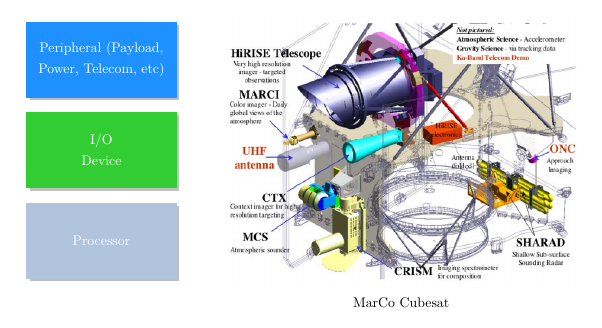

本文介绍使用tikz绘制简单的带文字、阴影的矩形图形。

### 一、环境
- Ubuntu 22.04
- XeTeX 3.141592653-2.6-0.999993

### 二、完整示例代码
```latex
% 繁星间漫步，陆巍的博客
\documentclass{ctexart}

\usepackage{geometry}% 用于页面设置
\usepackage[dvipsnames, svgnames, x11names]{xcolor}% 颜色支持
\usepackage{graphics}% 图形支持
\usepackage{tikz}% 绘图支持
\usetikzlibrary{shadows}% 阴影支持

% 页面设置
\geometry{
  a4paper,
  left = 1in,
  right = 1in,
  top = 1in,
  bottom = 1in
}

% 定义方框样式
\tikzset{
  rect1/.style = {
    shape = rectangle,% 指定样式
    minimum height=20mm,% 最小高度
    minimum width=40mm,% 最小宽度
    align = center,% 文字居中
    drop shadow,% 阴影
  }
}

\begin{document}
  \begin{tikzpicture}
    \node(a)[rect1, draw=DodgerBlue!, fill=DodgerBlue!, text width=3.5cm]
      {\color{white}Peripheral (Payload, Power, Telecom, etc)};
    \node[below of=a, yshift=-40pt](b)[rect1, draw=LimeGreen!, fill=LimeGreen!, text width=1.5cm]
      {\color{white}I/O Device};
    \node[below of=b, yshift=-40pt](c)[rect1, draw=LightSteelBlue!, fill=LightSteelBlue!]
      {\color{white}Processor};
    \node[label=below:MarCo Cubesat, right of=a, xshift=200pt, yshift=-70pt]
      {\includegraphics[width=100mm]{images/MRO.png}};
  \end{tikzpicture}

\end{document}
```

### 三、效果


### 四、说明
代码并不复杂，一看就明白，这里不再赘述。
