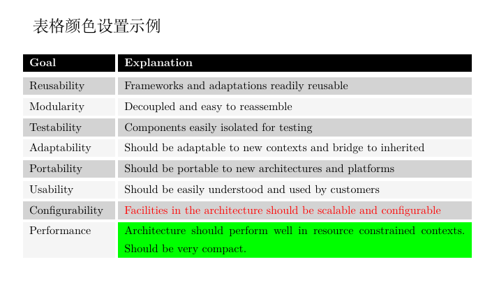

## LaTeX：表格颜色设置

---

本文简单介绍表格中的颜色设置方法。

### 一、环境
- Ubuntu 22.04
- XeTeX 3.141592653-2.6-0.999993

### 二、完整示例代码
```latex
% 繁星间漫步，陆巍的博客
\documentclass[UTF8]{ctexart}

\usepackage{geometry}% 用于页面设置
\usepackage[dvipsnames, svgnames, x11names]{xcolor}% 颜色支持
\usepackage{colortbl}% 表格颜色支持

% 页面设置
\geometry
{
  a4paper,
  left = 1in,
  right = 1in,
  top = 1in,
  bottom = 1in
}


% ------------------ 开始 -------------------
%
\begin{document}
  \Large 表格颜色设置示例\normalsize

  \vspace{4ex}
  
  \begin{tabular}{p{26mm}!{\color{white}\vrule width 3pt}p{112mm}}
    \rowcolor{black}\textcolor{white}{\textbf{Goal}} & \textcolor{white}{\textbf{Explanation}}\\
    \noalign{{\color{white}\hrule height 5pt}}
    \rowcolor{LightGray}Reusability & Frameworks and adaptations readily reusable\\
    \noalign{{\color{white}\hrule height 3pt}}
    \rowcolor{WhiteSmoke}Modularity & Decoupled and easy to reassemble\\
    \noalign{{\color{white}\hrule height 3pt}}
    \rowcolor{LightGray}Testability & Components easily isolated for testing\\
    \noalign{{\color{white}\hrule height 3pt}}
    \rowcolor{WhiteSmoke}Adaptability & Should be adaptable to new contexts and  bridge to inherited\\
    \noalign{{\color{white}\hrule height 3pt}}
    \rowcolor{LightGray}Portability & Should be portable to new architectures and platforms\\
    \noalign{{\color{white}\hrule height 3pt}}
    \rowcolor{WhiteSmoke}Usability & Should be easily understood and used by customers\\
    \noalign{{\color{white}\hrule height 3pt}}
    \rowcolor{LightGray}Configurability & \textcolor{red}{Facilities in the architecture should be scalable and configurable}\\
    \noalign{{\color{white}\hrule height 3pt}}
    \rowcolor{WhiteSmoke}Performance &\cellcolor{green} Architecture should perform well in resource constrained contexts. Should be very compact.
  \end{tabular}
\end{document}
```

### 三、效果


### 四、说明
代码已经清楚展现表格中各种颜色的设置方法，这里不再赘述。