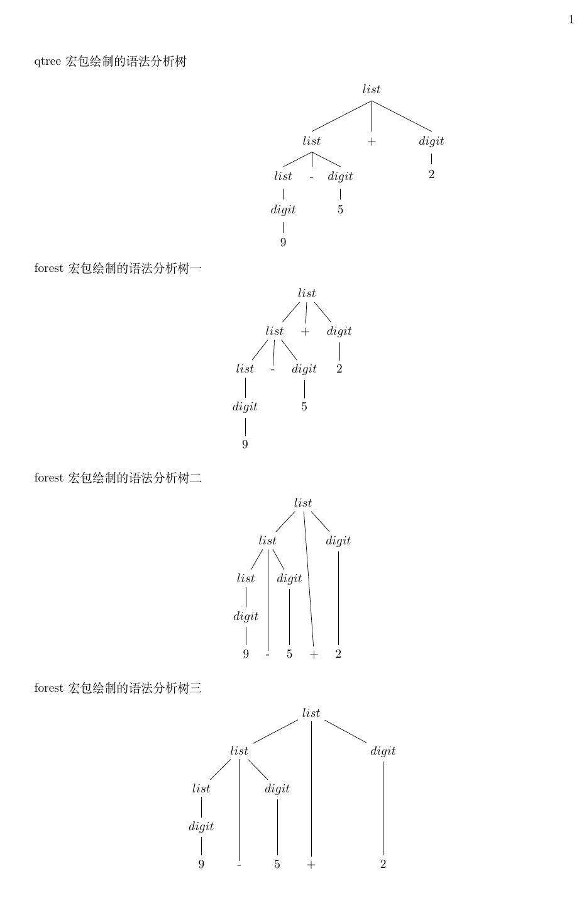

在LaTeX中绘制语法分析树的方法有多种，比如可以使用qtree宏包来绘制，但其功能有限，现在介绍功能更强的forest宏包。下面直接通过例子介绍。

### 一、环境
- 操作系统：Ubuntu 20.04
- 引擎：XeTeX 3.14159265-2.6-0.999991

### 二、代码
```latex
% 繁星间漫步，陆巍的博客
\documentclass[UTF8]{article}

% 注意宏包顺序，有可能会报错
\usepackage[fontset=ubuntu]{ctex}
\usepackage{geometry}% 用于页面设置
\usepackage{qtree}% 绘制语法分析树
\usepackage{forest}% 绘制语法分析树

% 设置为A4纸
\geometry{
  a4paper,
  left=1in,
  right=1in,
  top=1in,
  bottom=1in
}

% ------------------ 开始 -------------------
\begin{document}
qtree宏包绘制的语法分析树
\begin{center}
  \Tree [.$list$
          [.$list$
            [.$list$ [.$digit$ 9 ]]
            -
            [.$digit$ 5 ]
          ]
          +
          [.$digit$ 2 ]
      ]
\end{center}

forest宏包绘制的语法分析树一
\begin{center}
  \begin{forest}
    [$list$,
      [$list$,
        [$list$ [$digit$ [9]]]
        [-]
        [$digit$ [5]]
      ]
      [+]
      [$digit$ [2]]
    ]
  \end{forest}
\end{center}

forest宏包绘制的语法分析树二
\begin{center}
  \begin{forest}
    [$list$,
      [$list$,
        [$list$ [$digit$ [9, tier = word]]]
        [-, tier = word]
        [$digit$ [5, tier = word]]
      ]
      [+, tier = word]
      [$digit$ [2, tier = word]]
    ]
  \end{forest}
\end{center}

forest宏包绘制的语法分析树三
\begin{center}
  \begin{forest}
    [$list$, s sep = 3em
      [$list$, s sep = 2em
        [$list$ [$digit$ [9, tier = word]]]
        [-, tier = word]
        [$digit$ [5, tier = word]]
      ]
      [+, tier = word, before computing xy={s/.average={s}{siblings}}]
      [$digit$ [2, tier = word]]
    ]
  \end{forest}
\end{center}

\end{document}
```

### 三、pdf内容


### 四、说明
- 第一个例子使用的是qtree宏包绘制的；
- 使用forest宏包绘制的图形有三幅，第一幅没有做任何修饰，看上去与qtree绘制的差不多，只是节点和展开角度不一样；第二幅为了更好的展示，使用了tier=word语句；第三幅是在第二幅的基础上进行了角度上的调整，看上去就要美观一些。
- forest宏包实际上是建立在tikz宏包的基础上。