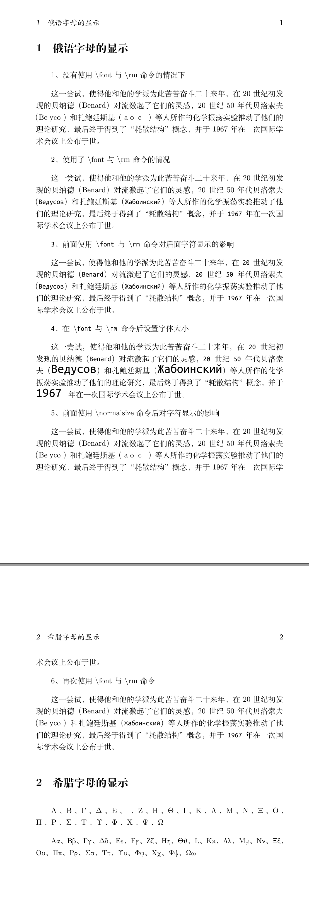

## 使用font与rm命令显示特殊字符

---

我们在编写LaTeX文档时，有时候会插入一些特殊字符，通常在编辑器里显示都正常，但编译后的pdf文件有时候不会显示或者用方框代替。本文介绍使用\font与\rm命令来解决部分特殊字符显示的问题。

### 一、环境
- Ubuntu 22.04
- XeTeX 3.141592653-2.6-0.999993

### 二、完整示例代码
```latex
% 繁星间漫步，陆巍的博客
\documentclass[UTF8,a4paper]{ctexart}

% 设置章节标题左对齐，+=表示在原有格式上追加，如果只有=则表示完全替换
\ctexset{
  section/format += \raggedright,
  subsection/format += \raggedright,
  subsubsection/format += \raggedright,
}

\setlength{\parindent}{2em}% 缩进
\setlength{\parskip}{2ex} % 段间距


% ------------------ 开始 -------------------
\begin{document}
\section{俄语字母的显示}
1、没有使用$\backslash$font与$\backslash$rm命令的情况下

这一尝试，使得他和他的学派为此苦苦奋斗二十来年，在20世纪初发现的贝纳德（Benard）对流激起了它们的灵感，20世纪50年代贝洛索夫（Beдycoв）和扎鲍廷斯基（Жaбoинcкий）等人所作的化学振荡实验推动了他们的理论研究，最后终于得到了“耗散结构”概念，并于1967年在一次国际学术会议上公布于世。

2、使用了$\backslash$font与$\backslash$rm命令的情况

这一尝试，使得他和他的学派为此苦苦奋斗二十来年，在20世纪初发现的贝纳德（Benard）对流激起了它们的灵感，20世纪50年代贝洛索夫（\font\rm="Ubuntu Mono"\rm Beдycoв）和扎鲍廷斯基（Жaбoинcкий）等人所作的化学振荡实验推动了他们的理论研究，最后终于得到了“耗散结构”概念，并于1967年在一次国际学术会议上公布于世。

3、前面使用$\backslash$font与$\backslash$rm命令对后面字符显示的影响

这一尝试，使得他和他的学派为此苦苦奋斗二十来年，在20世纪初发现的贝纳德（Benard）对流激起了它们的灵感，20世纪50年代贝洛索夫（Beдycoв）和扎鲍廷斯基（Жaбoинcкий）等人所作的化学振荡实验推动了他们的理论研究，最后终于得到了“耗散结构”概念，并于1967年在一次国际学术会议上公布于世。

4、在$\backslash$font与$\backslash$rm命令后设置字体大小

这一尝试，使得他和他的学派为此苦苦奋斗二十来年，在20世纪初发现的贝纳德（Benard）对流激起了它们的灵感，20世纪50年代贝洛索夫（\font\rm="Ubuntu Mono" at 18pt\rm Beдycoв）和扎鲍廷斯基（Жaбoинcкий）等人所作的化学振荡实验推动了他们的理论研究，最后终于得到了“耗散结构”概念，并于1967年在一次国际学术会议上公布于世。\normalsize

5、前面使用$\backslash$normalsize 命令后对字符显示的影响

这一尝试，使得他和他的学派为此苦苦奋斗二十来年，在20世纪初发现的贝纳德（Benard）对流激起了它们的灵感，20世纪50年代贝洛索夫（Beдycoв）和扎鲍廷斯基（Жaбoинcкий）等人所作的化学振荡实验推动了他们的理论研究，最后终于得到了“耗散结构”概念，并于1967年在一次国际学术会议上公布于世。

6、再次使用$\backslash$font与$\backslash$rm命令

这一尝试，使得他和他的学派为此苦苦奋斗二十来年，在20世纪初发现的贝纳德（Benard）对流激起了它们的灵感，20世纪50年代贝洛索夫（Beдycoв）和扎鲍廷斯基（\font\rm="Ubuntu Mono"\rm Жaбoинcкий）等人所作的化学振荡实验推动了他们的理论研究，最后终于得到了“耗散结构”概念，并于1967年在一次国际学术会议上公布于世。


\section{希腊字母的显示}
\normalsize

Αα、Ββ、Γγ、Δδ、Εε、Ϝϝ、Ζζ、Ηη、Θθ、Ιι、Κκ、Λλ、Μμ、Νν、Ξξ、Οο、Ππ、Ρρ、Σσ、Ττ、Υυ、Φφ、Χχ、Ψψ、Ωω

\font\rm="CMU Serif"\rm 

Αα、Ββ、Γγ、Δδ、Εε、Ϝϝ、Ζζ、Ηη、Θθ、Ιι、Κκ、Λλ、Μμ、Νν、Ξξ、Οο、Ππ、Ρρ、Σσ、Ττ、Υυ、Φφ、Χχ、Ψψ、Ωω

\end{document}
```

### 三、生成的pdf文件内容

### 四、说明
- 在第1节俄语字母显示的示例中，第一项展示了没有使用\font与\rm命令时的情况，生成的pdf文件中没有显示出俄语字母。
- 使用\font与\rm命令后，我们可以看到俄语字母能够正常显示，并且\font与\rm命令可以对下一段文字中的俄语字母也有效。但是当使用\normalsize命令后，\font与\rm命令的作用被中止了。其他命令是否会有同样的中止作用，我没有试过，大家可以在使用中注意观察。
- \font\rm命令还可设置字体大小，但其作用只针对相应字体内的字符。示例中可以看到字体设置对汉语字符无效。
- 示例中的第2节展示了显示希腊字母的效果，但这里使用的字体有所不同，是“CMU Serif”字体。要注意的是，这个字体不是Ubuntu自带的，需要我们从别处添加。之所以不使用“Ubuntu Mono”字体，是因为此字体不能完整正常的显示希腊字母。