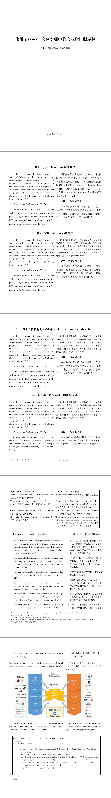

本文介绍使用paracol宏包实现中英文双栏排版。

### 一、示例代码编译环境
- Ubuntu 22.04
- XeTeX 3.141592653-2.6-0.999993

### 二、示例代码
```latex
% 繁星间漫步，陆巍的博客
\documentclass[UTF8, oneside]{ctexbook}

\usepackage{geometry}% 用于页面设置
\usepackage[dvipsnames, svgnames, x11names]{xcolor}% 颜色支持
\usepackage{graphicx}% 图形支持
\usepackage[
  colorlinks=true,
  linkcolor=Navy,
  urlcolor=Navy,
  citecolor=Navy,
  anchorcolor=Navy
]{hyperref}% 设置超链接颜色
\usepackage{enumerate}% 枚举支持
\usepackage{listings}% 代码显示支持
\usepackage{paracol}% 支持多栏

% 设置为A4纸，边距适中模式（参考永中office）
\geometry{
  a4paper,
  left = 19.1mm,
  right = 19.1mm,
  top = 25.4mm,
  bottom = 25.4mm
}

% 代码显示样式设置
\lstset{
  breaklines,% 自动换行
  basicstyle=\small,% 设置字体大小
  frame=single,% 单线框
  numbers=left,% 行号在左边
  numberstyle=\tiny,% 行号字体大小
  keywordstyle = \color[RGB]{0, 0, 160},% 关键字颜色
  commentstyle = \color[RGB]{160, 160, 160},% 注释颜色
  stringstyle  = \color[RGB]{0, 0, 255},% 字符串颜色
}

\setlength{\parindent}{2em}% 缩进
\setlength{\parskip}{2ex} % 段间距

% ------------------ 开始 -------------------
\begin{document}
% ------------------ 封面 -------------------
\begin{titlepage}
  \begin{center}
    \quad

    \vspace{.2\textheight}
    \huge\textbf{使用paracol宏包实现中英文双栏排版示例}

    \vspace{2ex}
    \normalsize CSDN，繁星间漫步，陆巍的博客

    \vfill
    2022年8月20日
  \end{center}
\end{titlepage}

% ------------------ 正文 -------------------
\mainmatter

\section{\textbackslash switchcolumn命令分栏}
\begin{paracol}{2}
  Agile is a buzzword of software development, and so all DoD software development projects are, almost by default, now declared to be “agile.” The purpose of this document is to provide guidance to DoD program executives and acquisition professionals on how to detect software projects that are really using agile development versus those that are simply waterfall or spiral development in agile clothing (“agile-scrum-fall”).
  
  \large\textbf{Principles, Values, and Tools}
  
  Experts and devotees profess certain key “values” to characterize the culture and approach of agile development. In its work, the DIB has developed its own guiding maxims that roughly map to these true agile values:

  \switchcolumn
  敏捷是软件开发的一个热门词汇，因此国防部所有的软件开发项目现在几乎在默认情况下都被宣布为“敏捷”。本文的目的是为国防部项目主管和采购专业人员提供指导，指导他们如何识别真正使用敏捷开发的软件项目，以及那些披着敏捷外衣的瀑布式或螺旋式开发(“agile-scrum-fall”)。

  \large\textbf{原则、价值观和工具}

  专家和拥护者声称某些关键的“价值观”是敏捷开发文化和方法的特征。在其工作中，DIB（国防创新委员会）制定了自己的指导准则，大致符合这些真正的敏捷价值观：
\end{paracol}


\section{使用column环境分栏}
\begin{paracol}{2}
  \begin{column}
    Agile is a buzzword of software development, and so all DoD software development projects are, almost by default, now declared to be “agile.” The purpose of this document is to provide guidance to DoD program executives and acquisition professionals on how to detect software projects that are really using agile development versus those that are simply waterfall or spiral development in agile clothing (“agile-scrum-fall”).
    
    \large\textbf{Principles, Values, and Tools}
    
    Experts and devotees profess certain key “values” to characterize the culture and approach of agile development. In its work, the DIB has developed its own guiding maxims that roughly map to these true agile values:
  \end{column}
  
  \begin{column}
    敏捷是软件开发的一个热门词汇，因此国防部所有的软件开发项目现在几乎在默认情况下都被宣布为“敏捷”。本文的目的是为国防部项目主管和采购专业人员提供指导，指导他们如何识别真正使用敏捷开发的软件项目，以及那些披着敏捷外衣的瀑布式或螺旋式开发(“agile-scrum-fall”)。

    \large\textbf{原则、价值观和工具}

    专家和拥护者声称某些关键的“价值观”是敏捷开发文化和方法的特征。在其工作中，DIB（国防创新委员会）制定了自己的指导准则，大致符合这些真正的敏捷价值观：
  \end{column}
\end{paracol}


\section{对于双栏特有的分栏环境：\textbackslash leftcolumn与\textbackslash rightcolumn}
\begin{paracol}{2}
  \begin{leftcolumn}
    Agile is a buzzword of software development, and so all DoD software development projects are, almost by default, now declared to be “agile.” The purpose of this document is to provide guidance to DoD program executives and acquisition professionals on how to detect software projects that are really using agile development versus those that are simply waterfall or spiral development in agile clothing (“agile-scrum-fall”).
    
    \large\textbf{Principles, Values, and Tools}
    
    Experts and devotees profess certain key “values” to characterize the culture and approach of agile development. In its work, the DIB has developed its own guiding maxims that roughly map to these true agile values:
  \end{leftcolumn}
  
  \begin{rightcolumn}
    敏捷是软件开发的一个热门词汇，因此国防部所有的软件开发项目现在几乎在默认情况下都被宣布为“敏捷”。本文的目的是为国防部项目主管和采购专业人员提供指导，指导他们如何识别真正使用敏捷开发的软件项目，以及那些披着敏捷外衣的瀑布式或螺旋式开发(“agile-scrum-fall”)。

    \large\textbf{原则、价值观和工具}

    专家和拥护者声称某些关键的“价值观”是敏捷开发文化和方法的特征。在其工作中，DIB（国防创新委员会）制定了自己的指导准则，大致符合这些真正的敏捷价值观：
  \end{rightcolumn}
\end{paracol}


\section{插入不分栏的表格、图片与代码块}
% 注脚摆放位置命令，只能在paracol环境外定义。
% - c，默认位置，注脚位于各栏的下方；
% - p，与普通排版方式一样，注脚位于页面下方，不分栏；
% - m，与p类似，但是会与同一页面paracol环境外的注脚合并，在本例中p与m效果一样。
\footnotelayout{c}
\begin{paracol}{2}
  \begin{leftcolumn}
    Agile is a buzzword of software development, and so all DoD software development projects are, almost by default, now declared to be “agile.” The purpose of this document is to provide guidance to DoD program executives and acquisition professionals on how to detect software projects that are really using agile development versus those that are simply waterfall or spiral development in agile clothing (“agile-scrum-fall”).
  \end{leftcolumn}
  \begin{rightcolumn}
    敏捷是软件开发的一个热门词汇，因此国防部所有的软件开发项目现在几乎在默认情况下都被宣布为“敏捷”。本文的目的是为国防部项目主管和采购专业人员提供指导，指导他们如何识别真正使用敏捷开发的软件项目，以及那些披着敏捷外衣的瀑布式或螺旋式开发(“agile-scrum-fall”)。
  \end{rightcolumn}
  
  \begin{leftcolumn*}
    \large\textbf{Principles, Values, and Tools}
  \end{leftcolumn*}
  \begin{rightcolumn}
    \large\textbf{原则、价值观和工具}
  \end{rightcolumn}
  
  \begin{leftcolumn*}
    Experts and devotees profess certain key “values” to characterize the culture and approach of agile development. In its work, the DIB\footnote*[1]{Defense Innovation Board} has developed its own guiding maxims that roughly map to these true agile values:
  \end{leftcolumn*}
  \begin{rightcolumn}
    专家和拥护者声称某些关键的“价值观”是敏捷开发文化和方法的特征。在其工作中，DIB\footnote*[1]{国防创新委员会}制定了自己的指导准则，大致符合这些真正的敏捷价值观：
  \end{rightcolumn}
  
  \begin{leftcolumn*}
    \begin{center}
      \begin{tabular}[b]{|p{.95\linewidth}|p{.95\linewidth}|}
        \hline
        \textbf{Agile Value / 敏捷价值观} & \textbf{DIB maxim / DIB格言}\\
        \hline
        Individuals and interactions over processes and tools / 个体和交互胜过过程和工具 & “Competence trumps process” / “能力胜过过程”\\
        \hline
        Working software over comprehensive documentation / 可以工作的软件胜过面面俱到的文档 & “Minimize time from program launch to deployment of simplest useful functionality” / “尽量缩短从程序启动到部署最简单有用功能的时间”\\
        \hline
        Customer collaboration over contract negotiation / 客户合作胜过合同谈判 & “Adopt a DevSecOps culture for software systems” / “在软件系统上采用DevSecOps文化”\\
        \hline
        Responding to change over following a plan / 响应变化胜过遵循计划 & “Software programs should start small, be iterative, and build on success - or be terminated quickly” / “软件程序应该从小处着手，进行迭代，并建立在成功的基础上——或者迅速终止”\\
        \hline
      \end{tabular}
    \end{center}
  \end{leftcolumn*}
\end{paracol}

% 使用此命令后，要从其后的\begin{paracol}才开始生效
\columnratio{0.6}
\footnotelayout{p}
\begin{paracol}{2}
  \begin{leftcolumn*}
    Key flags that a project is not really agile:
  \end{leftcolumn*}
  \begin{rightcolumn}
    一个项目不是真正敏捷的关键标志：
  \end{rightcolumn}

  \begin{leftcolumn*}
    \begin{itemize}
      \item Nobody on the software development team is talking with and observing the users of the software in action; we mean the actual users of the actual code.\footnote*[1]{Acceptable substitutes for talking to users: Observing users working, putting prototypes in front of them for feedback, and other aspects of user research that involve less talking.} (The PEO does not count as an actual user, nor does the commanding officer, unless she uses the code.)
      \item Continuous feedback from users to the development team (bug reports, users       assessments) is not available. Talking once at the beginning of a program to verify requirements doesn’t count!
      \item Meeting requirements is treated as more important than getting something useful into the field as quickly as possible.
      \item Stakeholders (dev, test, ops, security, contracting, contractors, end-users, etc.)\footnote*[2]{Dev is short for development, ops is short for operations} are acting more-or-less autonomously (e.g., ‘it’s not my job.’)
      \item End users of the software are missing-in-action throughout development; at a minimum they should be present during Release Planning and User Acceptance Testing.
      \item DevSecOps culture is lacking if manual processes are tolerated when such processes can and should be automated (e.g., automated testing, continuous integration, continuous delivery).
    \end{itemize}
  \end{leftcolumn*}
  \begin{rightcolumn}
    \begin{itemize}
      \item 软件开发团队中没有人在与软件用户交谈和观察他们的行为；我们是指实际代码的实际用户。\footnote*[1]{与用户交谈的可接受替代方法：观察用户的工作情况，将原型放在他们面前以获得反馈，以及用户研究的其他涉及较少交谈的方面。}（PEO（项目执行官）不算是实际用户，指挥官也不算，除非她使用代码。）
      \item 没有用户对开发团队的持续反馈（错误报告、用户评估）。至于说在程序开始时与用户交谈过一次以验证需求，那不算数!
      \item 满足需求被视为比尽快将有用的东西投入现场更重要。
      \item 利益相关者（开发、测试、运营、安全、承包、承包商、最终用户等）或多或少都在自主行动（例如，"这不是我的工作"。）\footnote*[2]{Dev是开发的简称，OPS是运营的简称。}
      \item 软件的最终用户在整个开发过程中处于缺失状态;他们至少应该在发布计划和用户验收测试期间出现。
      \item 如果允许手动过程，而这些过程可以并且应该是自动化的（例如，自动化测试、持续集成、持续交付），则缺乏DevSecOps文化。
    \end{itemize}
  \end{rightcolumn}

  \begin{leftcolumn*}
    Some current, common tools in use by teams using agile development (these will change as better tools become available):
  \end{leftcolumn*}
  \begin{rightcolumn}
    目前使用敏捷开发的团队所用的一些常用工具（这些工具会随着更好工具的出现而改变）：
  \end{rightcolumn}

  \begin{leftcolumn*}
    \includegraphics[width = .9\textwidth]{figure1.png}
  \end{leftcolumn*}

  \begin{leftcolumn*}
    Git, ClearCase, or Subversion - version control system for tracking changes to source code. Git is the de facto open source standard for modern software development.
    
    ...
  \end{leftcolumn*}
  \begin{rightcolumn}
    Git, ClearCase，或者Subversion——用于跟踪源代码变更的版本控制系统。Git实际上是现代软件开发的开源标准。

    ...
  \end{rightcolumn}

  \begin{leftcolumn*}
    \begin{minipage}{.94\textwidth}
      \begin{lstlisting}
class MyFrameProtocol : public Svc::FramingProtocol {
  public:
    MyFrameProtocol() {}

    void frame(const U8 *const data, const U32 size, Fw::ComPacket::ComPacketType packet_type) {
        Fw::Buffer my_framed_data = m_interface.allocate(size);
        my_framed_data.getSerializeRepr().serialize(0xdeadbeef); // Some start word
        my_framed_data.getSerializeRepr().serialize(size);       // Write size
        my_framed_data.getSerializeRepr().serialize(data, size, true); // Data copied to buffer no length included
        m_interface.send(my_framed_data);
    }
};
    \end{lstlisting}
    \end{minipage}
  \end{leftcolumn*}
  
  \begin{leftcolumn*}
    Test
  \end{leftcolumn*}
  \begin{rightcolumn}
    测试
  \end{rightcolumn}
  
\end{paracol}

\end{document}
```
代码中调用了一个图片文件，如果要编译以上代码，请自行准备图片文件：figure1.png。

### 三、编译生成的pdf文件内容

四、说明
- 从代码中可以看到，我使用了三种方式来实现双栏排版。三者目前看来并没什么区别，按照自己的喜好选择吧。只是相对来说，后两者显得结构层次清晰一些。
- 实际上paracol宏包可以支持更多的栏，但只有前两种方式可以实现，第三种方式仅针对双栏排版。
- 在演示的三种方法中，文字内容的前三段我故意没有分开处理，目的是为了让大家看看paracol宏包提供的环境下，导言区的段落间距设置是有效的。有些多栏排版的宏包，并不支持对段落间距的设置。这里只是演示一下，一般情况下中英文对照的双栏排版，最好段落之间还是对应排列的好，以方便读者查对。
- 注意栏的命令或环境后的星号，是有规律的，请自行观察比较。
- 注脚的位置设置有三种，本例中演示了前两种，详情请看代码中的注释。至于选择哪一种，就看实际需要和自己的习惯了。
- 在双栏中插入表格、图片都比较简单，插入代码块则稍微麻烦一些。如果直接把代码块放在栏的环境下，代码块会受分栏影响，而只在所属分栏显示，这点和表格、图片不一样。示例中通过minipage环境包裹代码块，避免了分栏环境的影响。
- 大概因为受分栏尺寸的影响，表格、图片等的环境代码中总会有太宽的提示信息，不用管，对编译没有影响。
- 这里顺便提一下，在分栏排版中，\textwidth与\linewidth的值不一样，在调用时要加以区分。
- 关于paracol宏包的更多内容，等我用到后再添加。