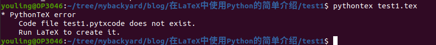
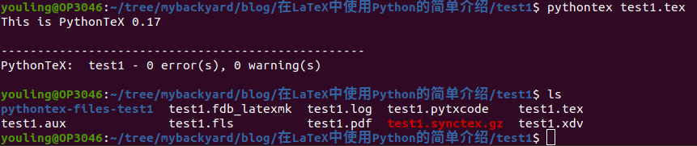
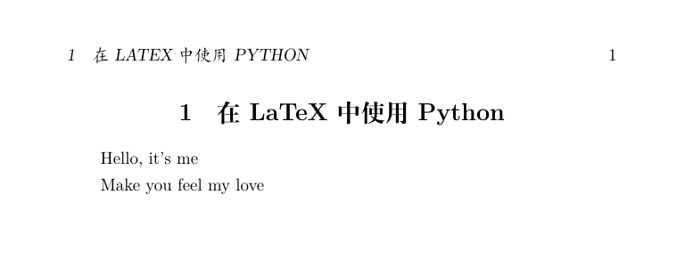
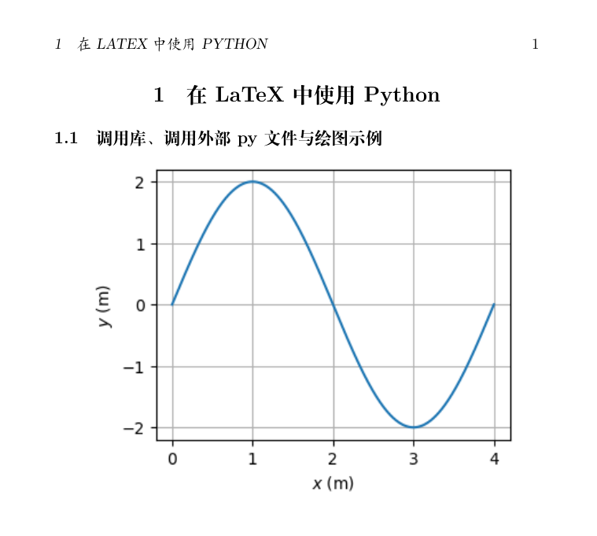
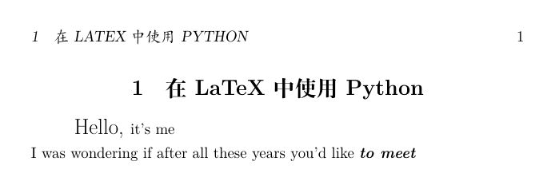

## 一、概述
Python语言自1991年2月发布最初代码开始，到现在已经有31年的历史，目前已经成为最热门的计算机语言之一。经过这么多年的发展，python得到了极大的扩展，把python的功能应用到LaTeX中也必然会增强LaTeX的灵活性、便捷性和应用面。

本文将简单介绍在LaTeX中使用pythontex宏包与pythontex引擎，来实现在LaTeX文档中调用python代码的方法。以前我推荐使用LuaTeX引擎来实现latex调用lua代码，现在介绍pythontex后，最后选择哪一种，咱们按照自己的实际情况边用边看吧。

## 二、环境
下面会列举一些例子，这些代码验证过的环境如下：

- 操作系统：Ubuntu 20.04
- 引擎一：XeTeX 3.14159265-2.6-0.999991
- 引擎二：PythonTeX 0.17

这里之所以列出两个引擎来，是因为两个都必须用。大博客园dfTeX，XeTeX支持的字符范围更大，所以我也不选用pdfTeX引擎。

## 三、编译步骤
对于普通的latex文档，编译时一般就只需要一步就可完成，例如：
```shell
xelatex test1.tex
```
只要没有错误，就可以生成相应的pdf文件。加入python代码后，步骤就从一步变为三步：
```shell
xelatex test1.tex

pythontex test1.tex博客园

xelatex test1.tex
```
第一步运行后一般都会报错，但不用管，并

### 1. 示例一

#### 1.1 test1.tex完整代码
```latex
% 繁星间漫步，陆巍的博客
\documentclass{ctexart}

\usepackage{pythontex}

\begin{pycode}
def test():
    print("Make you feel my love")
    return ""
\end{pycode}

\begin{document}
  \section{在LaTeX中使用Python}

  \begin{pycode} 
print("Hello, it's me")
  \end{pycode}

  \py{test()}

\end{document}
```

### 1.2 编译步骤
我们先来试一下开始就用pythontex命令编译test1.tex文件，结果如下：


可以看到提示错误，并且在此文件夹下没有任何文件（夹）产生。我们还是得按照“三步走”来执行，先用xelatex引擎编译，在项目文件夹中出现了以下文件：


这里就出现了错误提示中需要的test1.pytxcode文件。接下来执行第二步，运行pythontex命令：


经过pythontex的编译后，我们看到项目文件夹内多出一个文件夹：pythontex-files-test1

在执行第三步之前，我们可以看到tex文档的编辑窗口中，“\py{print(str1)}”代码下一直有问题提示，不用管。继续往下走，再一次使用xelatex引擎编译。这里要注意一点，此时tex文档中的内容与第一步时的内容并没有发生任何改变，如果使用的是VSCode编写tex文档，那么当我们点击xelatex编译时，有时候不会进行编译，这样我们看到的pdf文件中python代码输出的内容处就是些问号。因此，随便对tex中做一点修改，比如打一个空格，然后再用xelatex编译。本例编译后生成的pdf文件内容如下：


### 1.3 说明
- latex中调用的python代码格式同样要遵循相关的规定。比如说代码中的“print("Hello, it's me")”前面就不能有空格，def定义中的第二行同样要严格遵循4个空格缩进的规定。
- test()函数返回值为""，是为了避免在pdf文件中显示出讨厌的“None”。

### 2. 示例二

#### 2.1 完整代码
**a. test2.tex**
```latex
% 繁星间漫步，陆巍的博客
\documentclass{ctexart}

\usepackage{pythontex}
\usepackage{graphicx}

\begin{pycode}
from draw_test import *
DrawTest()
\end{pycode}

\begin{document}
  \section{在LaTeX中使用Python}

  \subsection{调用库、调用外部py文件与绘图示例}
 
  \includegraphics[width=0.9\textwidth]{draw_test.png}
\end{document}
```
**b. draw_test.py**
```python
# 繁星间漫步，陆巍的博客
from pylab import *

def DrawTest():
    figure(figsize=(4,3))
    x = linspace(0, 4, 1001)
    plot(x, 2*sin(2*pi*x/4))
    xlabel('$x$ (m)')
    ylabel('$y$ (m)')
    grid(True)
    savefig('draw_test.png', bbox_inches='tight')
    return ""
```

### 2.2 编译步骤
编译步骤与示例一一样，也是三步走。可能示例一在第一步时不一定会提示错误，但示例二的第一步肯定会提示找不到draw_test.png文件的错误，没关系，因为这个图片文件还没有产生。执行第二步后就会在项目文件夹内生成draw_test.png文件。

三步完成后生成的pdf文件内容如下：


### 2.3 说明
- 尽量把python代码与latex代码分别处理，道理在介绍调用lua代码时已经讲过。
- 本例中的draw_test.py文件中调用了pylab库，请在使用前先安装此库。
- 还是那个老问题，函数返回值可以设成空字符，以免在pdf文件上出现None。
- 在本示例的latex文档中，加载图形支持宏包时不要用graphics宏包，应该使用graphicx宏包，否则\includegraphics命令会报错，

### 3. 示例三

#### 3.1 完整代码
**test3.tex**
```latex
% 繁星间漫步，陆巍的博客
\documentclass{ctexart}

\usepackage{pythontex}

\begin{pycode}
def test(str1):
    str1 = str1 + "\\\\ I was wondering if after all these years you'd like \\textbf{\\textit{to meet}}"
    return str1
\end{pycode}

\newcommand{\PYtest}[1]{\py{test(#1)}}

\begin{document}
  \section{在LaTeX中使用Python}

  \PYtest{"\\Large Hello, \\normalsize it's me"}

\end{document}
```

### 3.2 编译步骤
同前

三步完成后生成的pdf文件内容如下：



### 3.3 说明
- 从效果来看，我们会发现无论是使用python的print，还是用函数返回值，其效果与调用lua语言时的tex.sprint一样，其作用都是把里面的内容交给latex，latex又把这些内容当成tex语句来处理。
- 使用print与使用函数返回值还是有些差别的，例如换行，使用print时既可以用python语言中的转义字符\n来实现，也可以用latex中的换行命令来实现，而函数返回值里面就只能用latex中的换行命令来实现。
- 这里同样要注意的是对特殊字符的处理。
- 前两个例子都缺乏latex与python的交互，用处很有限。本例子中演示了latex如何向python代码中传递数据，由此我们就可以用python来为latex做很多事。我们也可以不用示例中那样用\newcommand定义新命令调用\py来传递数据，直接用\py命令或者直接把要传的数据写在pycode环境里也是一样的。
- 既然我们已经实现latex对python的调用，并且在latex实现的功能与调用lua无异，是不是可以考虑用pythontex代替luatex？虽然编译步骤上稍微麻烦一样，但考虑到python背后庞大的资源支持…