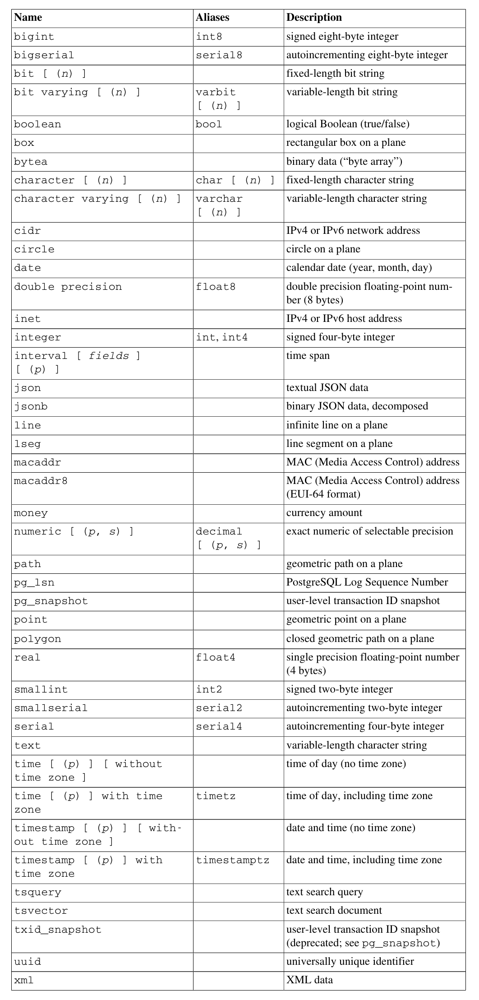

本文仅记录我使用到的部分命令示例。这里不对命令及各种参数做详细介绍，仅列出示例与简单说明。详细介绍可参考PostgreSQL官方发布的手册。

#### 已验证环境
- Ubuntu 22.04
- PostgreSQL 14.10

#### 1. 创建表命令：CREATE TABLE
- 示例1：
```sql
create table webpage(
    id serial primary key,
    name varchar(60) unique not null,
    contents text not null default '',
    scripts text not null default ''
);
```
简单说明：其中的serial表示是自增列，primary key为主键。unique表示唯一约束，not null表示不能为空，default为默认值。

#### 2. 修改表命令：ALTER TABLE
##### 2.1 修改表名或字段名：
```sql
alter table 表名 rename to 新表名;

alter table 表名 rename 字段名 to 新字段名;
```
##### 2.2 给指定字段设置默认值与删除默认值：
```sql
alter table webpage alter column contents set default '';

alter table webpage alter column contents drop default;
```
简单说明：修改默认值的命令与设置默认值的命令一样，即都使用set default来实现。

##### 2.3 修改字段类型：
```sql
alter table 表名 alter column 字段名 type 新类型;

alter table webpage alter column name type char(40);

alter table webpage alter column contents type text;
```
##### 2.4 删除约束
```sql
alter table webpage drop constraint webpage_name_key;
```
这里要注意的是，约束名称最好使用“\d 表名”命令查看，并根据查看结果来操作。
##### 2.5 添加约束
```sql
alter table webpage add unique(name);
alter table webpage add primary key(id);
alter table webpage alter column name set not null;
```
##### 2.6 删除字段
```sql
alter table webpage drop column name;
```

#### 3. 清空表命令：TRUNCATE
<font color="red">**慎用**</font>
- 示例1：
```sql
truncate webpage;
truncate webpage restart identity;
```
第2条命令后的参数，意思是自动重新开始被截断表的列所拥有的序列。例如设为主键的列，如果使用第1条命令，则以后增加记录时，主键的值会按原来的计数继续；使用第2条命令则从头开始。

&emsp;
#### 4. 删除表命令：DROP TABLE
<font color="red">**慎用**</font>
- 示例1：
```sql
DROP TABLE articles;
```

---

#### 附录：PostgreSQL14数据类型表
