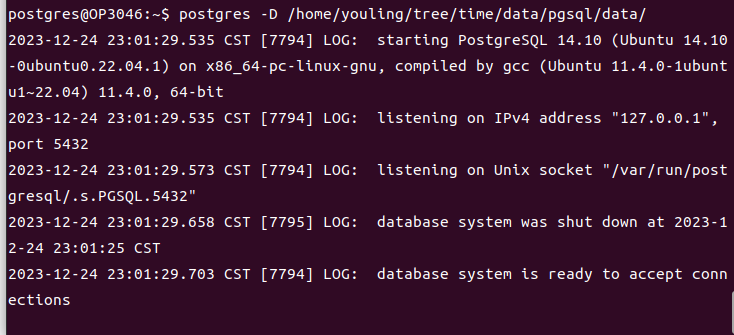
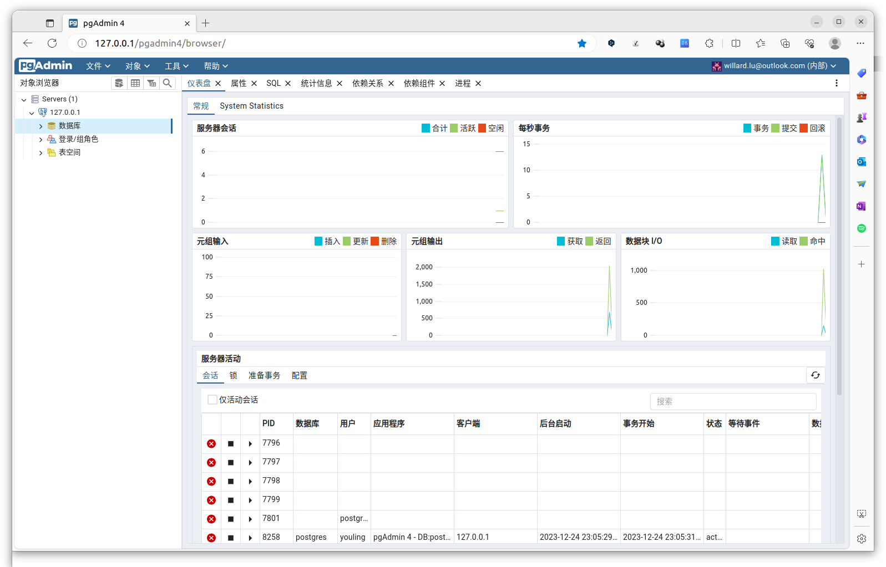

# 在Ubuntu22.04下安装PostgreSQL数据库的简单介绍

### 环境
- Ubuntu 20.04

---
### 1. 默认安装
在Ubuntu 22.04下，PostgreSQL的默认版本已经达到14.10（2023年12月）。于我而言，这个版本已经足够用，所以不使用官方介绍的方法来安装最新的版本，直接使用以下命令安装。
```bash
sudo apt install postgresql
```

### 2. 设置调用命令路径
PostgreSQL安装后会提供一些很有用的命令，但是并不能直接调用，需要我们编辑配置文件，把这些命令所在路径添加进去。可以先用find或者下面这个命令来查询这些postgresql命令所在目录：
```shell
locate initdb
```
如果还没有安装locate命令（通过名称发现文件）的话，可以用sudo apt install plocate来安装。

以上命令会列出下面的内容：
```bash
/etc/alternatives/initdb.1.gz
/usr/lib/postgresql/14/bin/initdb
/usr/share/man/man1/initdb.1.gz
/usr/share/postgresql/14/man/man1/initdb.1.gz
```
这个结果大家不一定相同。从结果中我们很容易就发现第2行正是我们需要的。编辑/etc/profile文件（因为其他账号也会使用这些命令，所以修改这个文件，而不是当前账号下的配置文件。），加入以下内容：
```bash
# PostgreSQL
export PATH=$PATH:/usr/lib/postgresql/14/bin
```
保存后注销、重新登录。这时每个账号都可以调用许多有用的PostgreSQL命令了。此外，这里也介绍一个查询当前PostgreSQL相关目录的命令：
```bash
ps auxw | grep postgres | grep -- -D
```
在我的电脑上显示的结果为：
```bash
postgres   11605  0.0  0.1 224024 30208 ?        Ss   22:05   0:00 /usr/lib/postgresql/14/bin/postgres -D /var/lib/postgresql/14/main -c config_file=/etc/postgresql/14/main/postgresql.conf

```
可以用以下命令查询当前postgresql的版本：
```bash
postgres --version
```

### 3. 用户设置
为了操作方便，我把当前操作系统用户（例如youling）加入到postgres用户组中。
```bash
sudo adduser youling postgres
```

### 4. 创建数据库集簇
PostgreSQL安装后，会生成一个默认的数据库存储区域。如果不想用默认的，那就自己创建一个新的区域（集簇）吧。比如，有的时候我们希望数据库是保存在移动介质上，需要使用时才挂到当地的PostgreSQL上。虽然可以使用备份还原来处理，但是相对麻烦。

先创建目录“/home/youling/tree/time/data/pgsql/”，然后使用下面的命令创建数据库集簇，注意后面的路径，根据自己的习惯进行设置。创建集簇的方法有好几种，这里暂时只介绍这一种。
```bash
sudo chown -R postgres:postgres /home/youling/tree/time/data/pgsql/
sudo service postgresql stop
sudo su - postgres
initdb -D /home/youling/tree/time/data/pgsql/data
postgres -D /home/youling/tree/time/data/pgsql/data
```

- 第1行命令把需要创建新集簇的目录权限赋给postgres；
- 第2行命令把正在运行的postgresql服务停止；
- 第3行命令切换到postgres用户下；
- 第4行命令用于创建新集簇；
- 第5行命令用于启用新集簇。

最后一行命令运行后会有类似下面的提示：


这样就表示已经成功启动，这个终端窗口就这样开着吧，如果用ctrl-c中断的话，服务也就停止了。我们另开一个窗口，用以下命令查询一下当前postgresql的状态：
```bash
ps auxw | grep postgres | grep -- -D
```
运行结果如下：
```
postgres   14532  0.0  0.1 223788 29184 pts/0    S+   22:19   0:00 postgres -D /home/youling/tree/time/data/pgsql/data/
```
从结果上可以看见，当前指向的数据库集簇正是我们新建的集簇。

### 5. 增加用户
PostgreSQL安装后，会有一个默认的账号：postgres。我们可以创建一个与当前使用的操作系统账号相同的数据库账号，例如我在Ubuntu下使用的youling账号。按照以下步骤创建，并且在创建时赋予相应权限。
```bash
sudo su - postgres
psql

create role youling with login createdb encrypted password '2023-1224';
\q
exit
```
现在就可以使用新账号在新的数据库集簇下工作了。在还没有新建任何数据库时，可以先用以下命令进入：
```bash
psql -d postgres
```
注意，这条命令是在youling用户下执行的。进入的是默认的postgres数据库。

### 6. 启动新集簇
如果不修改默认启动新集簇，只有在需要时才使用的话，可以用以下命令实现启动新集簇：
```bash
sudo service postgresql stop
sudo su - postgres
postgres -D /home/youling/tree/time/data/pgsql/data
```
如果需要经常使用新集簇，可以修改配置文件，在我的电脑上是：/etc/postgresql/14/main/postgresql.conf 。其中要修改的部分是：

**原文如下：**
```
#------------------------------------------------------------------------------
# FILE LOCATIONS
#------------------------------------------------------------------------------

# The default values of these variables are driven from the -D command-line
# option or PGDATA environment variable, represented here as ConfigDir.

data_directory = '/var/lib/postgresql/14/main'		# use data in another directory
					# (change requires restart)
hba_file = '/etc/postgresql/14/main/pg_hba.conf'	# host-based authentication file
					# (change requires restart)
ident_file = '/etc/postgresql/14/main/pg_ident.conf'	# ident configuration file
					# (change requires restart)

# If external_pid_file is not explicitly set, no extra PID file is written.
external_pid_file = '/var/run/postgresql/14-main.pid'			# write an extra PID file
					# (change requires restart)

#------------------------------------------------------------------------------
```
**修改后的内容**
```
#------------------------------------------------------------------------------
# FILE LOCATIONS
#------------------------------------------------------------------------------

# The default values of these variables are driven from the -D command-line
# option or PGDATA environment variable, represented here as ConfigDir.

#data_directory = '/var/lib/postgresql/14/main'		# use data in another directory
					# (change requires restart)
#hba_file = '/etc/postgresql/14/main/pg_hba.conf'	# host-based authentication file
					# (change requires restart)
#ident_file = '/etc/postgresql/14/main/pg_ident.conf'	# ident configuration file
					# (change requires restart)

# If external_pid_file is not explicitly set, no extra PID file is written.
external_pid_file = '/var/run/postgresql/14-main.pid'			# write an extra PID file
					# (change requires restart)

#------------------------------------------------------------------------------
data_directory = '/home/youling/tree/time/data/pgsql/data'
hba_file = '/home/youling/tree/time/data/pgsql/data/pg_hba.conf'
ident_file = '/home/youling/tree/time/data/pgsql/data/pg_ident.conf'
#------------------------------------------------------------------------------
```
大家可以看见只是修改了data_directory、hba_file与ident_file三处的内容，也就是修改成刚才我们创建新集簇的位置。原来的配置用#号注释掉即可。保存文件、重启，然后再运行命令：
```bash
ps auxw | grep postgres | grep -- -D
```
我们就会发现内容变成：
```
postgres     976  0.0  0.1 224024 29824 ?        Ss   22:32   0:00 /usr/lib/postgresql/14/bin/postgres -D /home/youling/tree/time/data/pgsql/data -c config_file=/etc/postgresql/14/main/postgresql.conf

```
默认的集簇已经指向新建的集簇。

### 7. 安装pgAdmin工具
为了方便使用PostgreSQL，可以安装工具pgAdmin，安装方法官方网站有详细介绍，地址是：[pgAdmin4](https://www.pgadmin.org/download/pgadmin-4-apt/)。网页上的安装介绍清楚、简单，就不再解释。安装完成后添加数据库，最后的管理页面效果如下：
