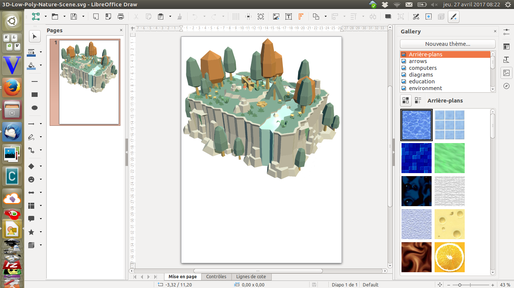
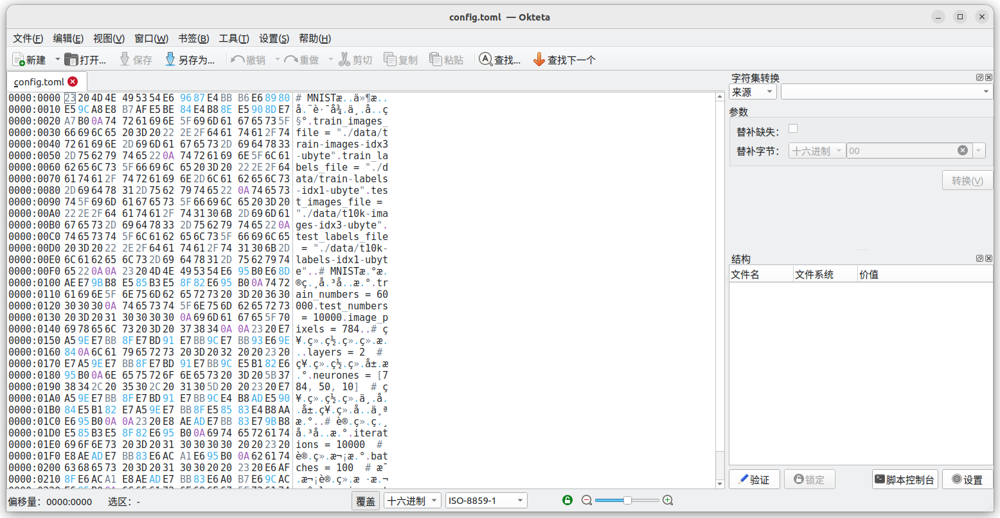
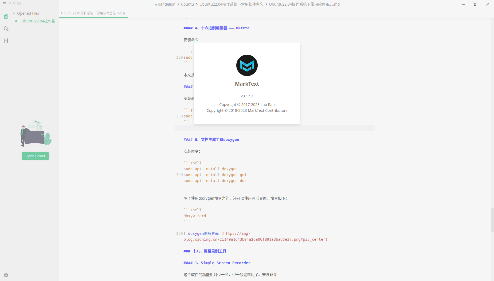
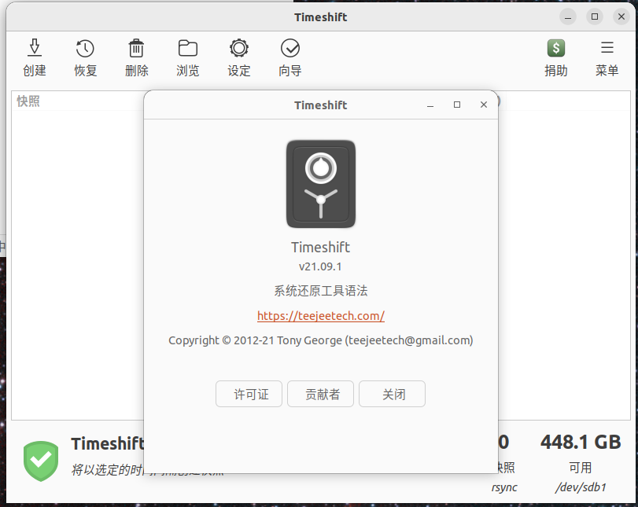

## Ubuntu 22.04操作系统下常用软件备忘

---

时间过得真快，不知不觉间Ubuntu的桌面版本已经到了22.04。本文记录我在Ubuntu 22.04下使用的部分软件，一方面供刚开始使用Ubuntu系统的朋友们参考，另外就是方便自己以后重装系统。下面介绍的软件，全部都是免费授权使用的，放心安装下载。

内容比较多，请打开右侧的目录查看自己感兴趣的内容。

### 一、浏览器

Ubuntu 22.04会默认安装Firefox浏览器，即便是最小安装模式下也会装上。火狐浏览器虽然表现不错，但某些网站表现不佳，或者就不支持，所以推荐再安装两个浏览器：Google Chrome和Microsoft Edge。三个浏览器都可以注册登录账户，从而实现同步功能。Google Chrome在这方面并不方便，如果嫌麻烦的话就把Microsoft Edge作为主要浏览器吧，至少目前微软的账号用起来还没多少阻碍。

#### 1、Microsoft Edge

下载地址：[Microsoft Edge下载](https://www.microsoft.com/zh-cn/edge)

如果以上下载地址打不开的话，可以用下面的命令来安装：

```shell
curl https://packages.microsoft.com/keys/microsoft.asc | gpg --dearmor > microsoft.gpg
sudo install -o root -g root -m 644 microsoft.gpg /etc/apt/trusted.gpg.d/
sudo sh -c 'echo "deb [arch=amd64] https://packages.microsoft.com/repos/edge stable main" > /etc/apt/sources.list.d/microsoft-edge-dev.list'
sudo rm microsoft.gpg
sudo apt update
sudo apt install microsoft-edge-dev
```

#### 2、Google Chrome

下载地址：[Google Chrome下载](https://www.google.cn/intl/zh-CN/chrome/)

#### 3、Firefox

已默认安装。

### 二、输入法

我本人用的是五笔输入法，拼音输入法就不介绍了。目前（2023年11月）系统提供的极点五笔输入法，我感觉已经够用，所以下面的介绍大家随便看看即可，若无特殊要求，就无需另外安装了。

五笔输入法方面的介绍请看我的另一篇博客：Ubuntu20.04下可用的一些五笔输入法介绍。虽然标题是20.04版的，在22.04下部分输入法也可以用。注意那些键盘输入法系统是fcitx的输入法，要先安装fcitx：

```shell
sudo apt install fcitx
```

安装好后，还要去设置中把键盘输入法系统改成fcitx。

**这里要特别提醒一下，fcitx输入法系统目前在Ubuntu 22.04下的表现有问题**。例如在某些软件中输入时（如文本编辑器），提示框不会跟着光标走，只会在屏幕中的某个固定位置。这些问题应该是fcitx没跟上Ubuntu 22.04的更新，而不是其下各家输入法的问题，因为fcitx下面的好几个输入法都同时表现出这些问题。

fcitx-table-wubi和极点五笔虽然都有以上问题，但都还可以使用。搜狗五笔输入法虽然能安装上去，但已经无法正常使用。百度的五笔输入法没有试过，有兴趣的朋友自己去试一下。

另外，Ubuntu 22.04下，在文本编辑器、文件（夹）重命名中调用“五笔加加”时有问题，某些按键会自动重复，现在知道的有退格键（Backup）、删除键（Delete）。大家用的时候要小心，或者换其他输入法。  

我目前使用ibus输入法系统下Rime的输入法，安装配置方法见Ubuntu 22.04下安装配置rime五笔输入法。

**注意，Ubuntu 22.04下的输入源已经移到“键盘”菜单里面，所以如果要添加ibus下的输入法，要选择“设置”里面的“键盘”。**

### 三、个人待办事项管理软件

我现在使用的是kuro软件，这是一个微软 to do 非官方的客户端，感觉还不错。kuro使用微软账号登录，因此可以和网页端、移动端的Microsoft to do同步。没有用过Microsoft to do的朋友可以先在手机上下载“to do”app感受一下。

安装方法：直接打开主桌面左侧收藏夹栏的“Ubuntu Software”，也就是软件商店里面搜索“kuro”安装即可。

### 四、图片处理、图形设计

#### 1、kolourpaint

这个软件和Windows下的画图软件几乎一模一样。

```shell
sudo apt install kolourpaint 
```

#### 2、gimp

功能类似于photoshop，只是没有那么强，但开源免费。

```shell
sudo apt install gimp
```

#### 3、Inkscape

这是一款开源免费的平面设计软件，类似于CorelDraw。

```shell
sudo apt install inkscape
```

#### 4、Krita

Krita 的首要用途是绘画（特别是手绘），其次才是图像处理。在处理绘画，特别是手绘方面，功能很强。这个软件也是跨平台、开源免费的，并且有丰富的中文使用说明。安装命令：

```shell
sudo apt install krita
```

#### 5、yEd

图表设计软件，适合绘制办公、软件开发、管理、科学等很多方面的图表，功能很强。下载地址：[https://www.yworks.com/products/yed](https://www.yworks.com/products/yed)
下载后是一个.sh文件，赋予权限后在终端下运行，例如：

```shell
sudo ./yEd-3.22_with-JRE15_64-bit_setup.sh
```

会出现图形安装界面，跟着走就行。此软件是java编写的，安装包里自带jre，不用自己另外安装。

#### 6、draw.io

功能很强的图形绘制软件，安装命令：

```shell
sudo snap install drawio
```

安装完成后，如果找不到软件的图标，可以在终端下执行命令drawio来启动。

#### 7、Pencil

这也是一个功能强大的绘图软件，下载地址：[http://pencil.evolus.vn/Downloads.html](http://pencil.evolus.vn/Downloads.html)。注意，不要用apt安装同名的pencil软件，二者不一样。

#### 8、LibreOffice Draw

这个属于LibreOffice办公套件中的一员，在绘制各种图表方面功能很强。在绘制某些专业图表时，我认为比前面介绍的各种绘图软件都更好用。



### 五、PDF文档阅读器

我使用okular来阅读pdf文档，其实olular可以阅读的文档类型还有很多种。以前我用过国内外开发的好几种pdf阅读器，目前看来，在Ubuntu上okular是综合表现最好的。可惜Adobe公司在2013年就停止开发Linux下的pdf阅读器，不然肯定会选Adobe的产品。

```shell
sudo apt install okular
```

### 六、代码编辑器

使用微软公司的Visual Studio Code。下载地址：[Visual Studio Code下载页](https://code.visualstudio.com/)。也可以使用snap安装（以前通过这个方式安装的vscode不能输入汉字，现在没有问题了。），命令如下：

```shell
sudo snap install code --classic
```

微软公司提供的下载地址，有时候很难下载，如果大家碰到这种情况，可以试试下面的方法：

#### 1、仍旧点上面列出的地址：[Visual Studio Code下载页](https://code.visualstudio.com/)，并点击下载按钮，如下图：


#### 2、点击deb下载安装文件，见下图中我用红圈标注的地方：

点击“deb”后，就开始下载了，速度很快。


#### 1、TexStudio

```shell
sudo apt install texstudio
```


这个软件功能完备、使用体验不错。另外建议在配置中勾选以下设置，以解决汉字编辑中的向下滚动问题。

注意要先勾选左下角的“Show Advanced Options”，才会在左边菜单中出现“Adv. Editor”条目，然后才能勾选右边红框圈住的选项。

#### 2、Visual Studio Code

安装方法见前面的描述。

### 八、Office办公套件

从支持国产软件和云同步考虑，推荐使用WPS。WPS除了桌面端外，还有手机端，并且对于个人用户免费。原来还推荐使用永中Office，但是目前永中的linux版本找不到下载点了。

#### 1、WPS

[WPS下载地址](https://linux.wps.cn/)

#### 2、LibreOffice

```shell
sudo apt install libreoffice
```

此外还有 Apache OpenOffice、OnlyOffice、FreeOffice、Calligra Suite等等，都是免费的，有兴趣的朋友可以安装看看。

### 九、下载工具

#### 1、axel

```shell
sudo apt install axel
```

这是一个很小的、通过命令行执行的下载工具，下面是示例：

```shell
axel -n 5 -o . https://az764295.vo.msecnd.net/stable/6d9b74a70ca9c7733b29f0456fd8195364076dda/code_1.70.1-1660113095_amd64.deb
```

### 十、媒体播放器

#### 1、VLC 媒体播放器

```shell
sudo apt install vlc
```


#### 2、smplayer媒体播放器

```shell
sudo apt install smplayer
```


### 十一、版本管理工具

Git

```shell
sudo apt install git
```

### 十二、压缩工具

已经默认安装压缩工具，但是不支持rar压缩文件，需要另外安装支持：

```shell
sudo apt install rar
```

7z 压缩文件支持：

```shell
sudo apt install p7zip-full

### 十三、云笔记

我一直用的云笔记软件是有道云笔记，现在官方已经有Linux版，下面是下载地址：
[有道云笔记下载页面](http://note.youdao.com/download.html)

### 十四、通讯、交流、移动办公

#### 1、QQ

下载地址是：[QQ官方下载](https://im.qq.com/linuxqq/index.html)

#### 2、微信

微信官方没有提供Linux版的，我在优麒麟上找到一个可用的，下载地址是：[优麒麟微信下载页面](https://www.ubuntukylin.com/applications/106-cn.html)。目前我使用下来，感觉基本上可以用，但存在一些小问题。例如聊天时输入一句话“CS的博客”，发现需要补充上“DN”两个字母，然后把光标移到S后面，刚输入D，光标就自动跳到句子的尾部，即“客”字后面。也就是说只要句子中间每插入、删除一个字符（即有任何改动），光标都会跳到句子结尾。因此，我一般是在文本编辑器里把要说的话打好，再复制粘贴到微信聊天窗口下发送。

#### 3、Skype

安装方法：

```shell
sudo snap install skype
```

#### 4、钉钉

下载地址是：[钉钉下载页面](https://alidocs.dingtalk.com/i/p/nb9XJlJ7QbxN8GyA/docs/ROGpvEna5YQWmaPgQ156W4ykmK3zoB27)，注意选择版本，Ubuntu的版本在网页最下面。

### 十五、网盘

#### 1、百度网盘

下载地址：[https://pan.baidu.com/download#linux](https://pan.baidu.com/download#linux)

目前发现百度网盘（大概是4.14.5版本）的主窗口与悬浮窗都对快捷键“Ctrl+空格”有影响，这个快捷键我用于切换输入法。因此当百度网盘的主窗口或悬浮窗开着时，切换输入法就会出问题，在设置中关闭悬浮窗并关闭主窗口，让百度网盘在后台运行，就不会有影响。

#### 2、竖果云

下载地址：[https://www.jianguoyun.com/s/downloads/linux](https://www.jianguoyun.com/s/downloads/linux)

### 十六、游戏

#### 1、Steam

下载地址：[https://store.steampowered.com/about/](https://store.steampowered.com/about/)

顺便介绍一个 Linux游戏资源网站：[Linux游戏站](https://www.linuxgame.cn/)

### 十七、软件开发相关

这方面实际上内容很多，此处只简单提一下，以后另外写博客来介绍。

#### 1、构建工具

```shell
sudo apt install cmake
```

#### 2、C++编译器

```shell
sudo apt install g++
```

c编译器gcc是默认安装的。

#### 3、Python IDE —— PyCharm社区版

安装命令：

```shell
sudo snap install pycharm-community --classic
```

Pycharm社区版是免费的，如果觉得不够用，就花钱购买专业版的吧，价格不贵。

#### 4、十六进制编辑器 —— Okteta

安装命令：

```shell
sudo apt install okteta
```

本来想用bless，但是安装后会闪退，所以就改用Okteta。



#### 5、Markdown编辑器 ——Marktext

安装命令：

```shell
sudo snap install marktext
```



#### 6、文档生成工具doxygen

安装命令：

```shell
sudo apt install doxygen
sudo apt install doxygen-gui
sudo apt install doxygen-doc
```

除了使用doxygen命令之外，还可以使用图形界面，命令如下：

```shell
doxywizard
```


### 十八、屏幕录制工具

#### 1、Simple Screen Recorder

这个软件的功能相对少一些，但一般是够用了。安装命令：

```shell
sudo apt install simplescreenrecorder
```

#### 2、OBS Studio

如果觉得上一个软件不够用，就用这个吧。安装命令：

```shell
sudo apt install obs-studio
```

### 十九、数学工具

#### 1、GeoGebra

免费的课堂活动数字工具, 用于绘图计算, 几何作图, 白板协作等等。安装命令：

```shell
sudo apt install geogebra
```


### 二十、同步与备份工具

世间并不存在绝对可靠的数据资料保存方式，只有通过多做几个备份来提高安全性。虽然有各种网盘可以用，但并非所有资料数据都适合放到网盘，所以这里介绍一些可用于本地数据资料同步与备份的工具软件。

#### 1、luckybackup

安装命令：

```shell
sudo apt install luckybackup
```


### 二十一、一些系统自带的小工具

#### 1、Wifi状况查看工具

因为现在无线网络使用很广泛，所以这里提一下查看所连wifi状况的小工具，可能会对大家有所帮助。我使用的是iwconfig命令，操作系统安装时已经默认安装，下面是监控命令：

```shell
watch -n1 iwconfig
```

#### 2、屏幕截图或录制工具

按住 Ctrl + Shift + Alt + R 四个键，就会调出操作界面，上面可以选择截图或录制，还可以选择区域、全屏、窗口等。

### 二十二、硬件信息查看工具

#### 1、Hardinfo

可以查看各种硬件信息、温度等。安装命令如下：

```shell
sudo apt install hardinfo
```


### 二十三、操作系统安装盘（U盘）制作工具

可以用镜像文件制作安装操作系统的U盘，安装命令如下：

```shell
sudo apt install usb-creator-kde
```

也可以在软件商店中搜索startup来安装。


### 二十四、软件包管理工具Muon

用于安装、更新、删除软件包的管理工具，安装命令如下：

```shell
sudo apt install muon
```

也可以在软件商店中搜索安装。


### 二十五、虚拟机软件VirtualBox

安装命令：

```shell
sudo apt install virtualbox
```


---

### 二十六、系统还原工具timeshift

安装命令：
```shell
sudo apt install timeshift
```




持续更新中…
